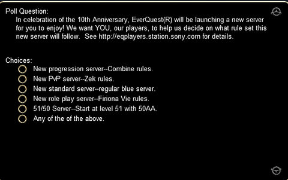

# EverQuest's new server -- what are the choices?

Way back in December, SOE mentioned offhandedly that they would be [adding a NEW server](../index.php/2008/12/19/everquest-merging-servers-adding-new-server-in-2009/) to EverQuest -- the first since the [two progression servers](../index.php/2006/06/21/progression-server-update/) from a couple of years ago.

A couple of days ago, while writing about the "[Classic EQ Petition](../index.php/2009/03/12/classic-eq-petition/)" that was going around, Egat mentioned in the comments that there was now a poll when you logged into EverQuest, putting it to the players what kind of server they wanted to see.

**New Progression Server -- Combine rules** -- The EQ devs acknowledged there were some issues with making only the appropriate content available at the correct times on the progression servers last time, and if they had a chance to do it again, they'd do it better, for a more classic experience. The Progression servers start with just the zones from the original game available. Then, as the players conquer the content -- killing Nagafen, Vox and Phinegal -- they open new expansions, in the order in which they are released, until they reach the current state of the game, after which they are treated like any normal "blue" server.

**New PvP Server -- Zek rules** -- Free for all PvP with 1 item + coin looting.

**New standard server -- regular blue server** -- The last no-transfer, standard rules server was Stromm, launched in 2003. I restarted on that server and loved it, but that was before a lot of the modern changes, like hirelings and the whole Serpent's Spine new leveling path, which would make it a far faster game. This would be the "race to the top" server.

**New roleplay server -- Firiona Vie rules** -- You start out speaking only your racial language, one character only, most no trade items are tradeable here, trivial loot rules apply (I believe) meaning no magic loot from mobs you don't gain xp from. You used to be able to transfer on to the FV server, but you will never leave it.

**51/50 server -- start at level 51 with 50 AAs** -- This is pretty intriguing. You start with a strong, mid-game character, with enough AAs for your basic class abilities, and if you want, you can create a new character and then go kill Vox and Nagafen. I really think this should be an option for the LIVE servers -- maybe a chit you can buy from the Station Marketplace that boosts you up. I see a lot of problems with this ruleset -- everyone -- EVERYONE -- would have a second account running with whatever high level alt they needed that day. Plus mercs.

**Any of the of the above** -- Yeah, that's how they wrote it. This is a non-vote.

So, which to choose? Which would bring you back to EverQuest -- or have you start over if you still play? Log in and cast your vote. I have two accounts, so I voted for both Combine and FV rules -- but I secretly hope FV wins.

