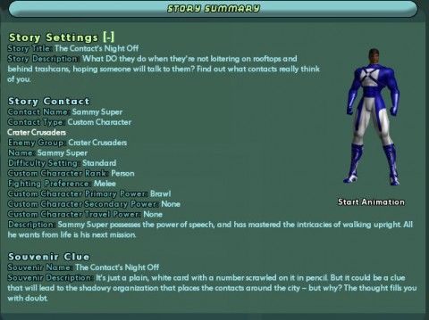
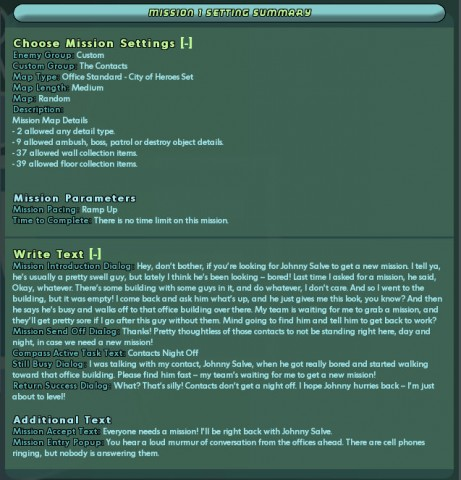
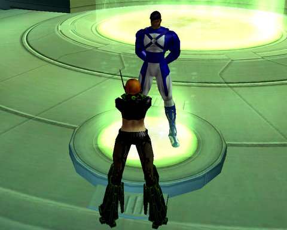
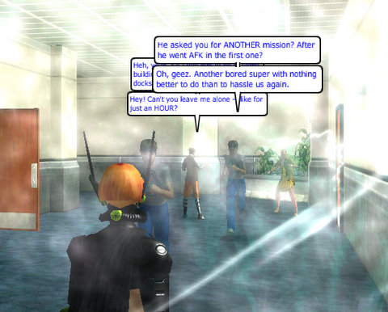
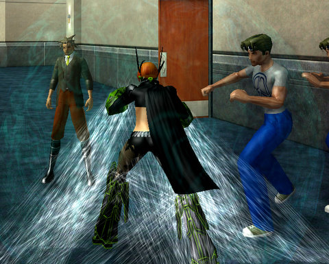

# City of Heroes Architect system: Don't you know that you're my hero?

It's the wave of the future. No, it's not the wave of the future. Handing the level making tools to the players is the wave of the past, and it's made game after game stick around for years past the "sell by" date. Half Life, Warcraft III, Unreal 2... It doesn't take a genius to see that tapping the boundless enthusiasm and creativity of your players can be a *good thing*.

There's no good reason this hasn't become a larger part of MMO gaming. City of Heroes has always been an innovator in the MMO world, so it's really no surprise that they were the first to make a really bold move into player-created content with the Architect system that comes with Issue 14, and in open beta now.

After a lengthy patch and a long wait for the servers to slow down enough to squeeze in, I ran to the Architect offices, found a spare console, and started to create. I got the Thrill Seeker badge just for showing up, and time toward the Architect day job by logging out in the Architect offices.

The concept behind Architect is that you are making a holodeck mission for the enjoyment of you and your friends. This is a holodeck mission with player damage turned ON, but the rewards can only be spent on items the Architect corporation sells. The rewards might be virtual, but the experience is real, and ... it's okay to have a little fun with it.

I called my mission, "Contacts Night Off". What if all the mission contacts who seem to have no lives aside from standing around, waiting for a hero or villain to call them about a mission, just decided to go home? And sleep? Or just not get hassled by mission-seeking players?

  
*Click to see this at full size*

Any new story arc starts with a contact. But -- they've all gone home! Enter Sammy Super. Sammy's got a team waiting for him to grab a mission and get the heck back before they get bored and kick him out of the team. All he wants is a mission -- but his contact, Johnny Salve, just walked off and isn't answering his cell phone! He can't go after him because he's in a super team and they'd be pretty pissed if he went off and did a solo mission without them -- but maybe you could get Johnny and tell him to get back to work?

Sammy Super is impatient and whiny, but you've noticed that all YOUR contacts have gone missing as well. It's in your own best interests to track them down. So you accept, and head out -- or in this case, head into the light.

  
*Click to see this at full size*

The process is fairly painless; you can quickly make a mission simply by choosing goals, enemy groups (and you can pick from any enemy group on both the hero and villain sides), any special NPCs, special mission objectives -- if you ever encountered something in a mission, it's available to you here.

I made a custom enemy group called The Contacts, with various levels of NPCs dressed in contact-y clothing. The kind of NPCs you might take a long look at and wonder what sort of mission they would give. Minions, Lieutenants, Bosses... and beyond that, several ranks of more difficult enemies. And of course, for the end of the mission, the rogue contact, Johnny Salve.

The bare bones of a mission created, I set it to test mode and entered the mission I just made.

Sammy Super stood before me, complaining about the rudeness of contacts these days.

Ah, Sammy Super. Could anyone be as generic as you?

I battled through hordes of contacts who just wanted to be left alone and it turns out all those people weren't quite as defenseless as they'd have us believe. They put up a heck of a fight, but in the end, I defeated them all, and finally came across Johnny Salve, chatting it up with other lazy contacts.

The jig's up, Johnny. You're coming with me.

Final verdict? Too soon to say. It is extremely easy to write a mission, but you can't color outside the lines. My first idea -- go backstage at a concert, gathering backup dancers for a huge dance off -- was impossible. You can only do what missions do, and while you can choose from every single animation in the game, you can't really get people to follow you and then do a dance routine.

But if you want to make your own enemy groups, your own supervillains to fight, your own story -- heck, if you just want to make a mission populated with you and your alts that recreate some of your most famous fights, you can do that. Want to make a mission with just straight up action and constant fighting? You can do that. Want to make a murder mystery? Mmm... I think you could do that.

It won't be long before all the really good MMOs come with these sorts of tools, but for now, you have to come to City of Heroes to get a glimpse of the future.

Big win.

