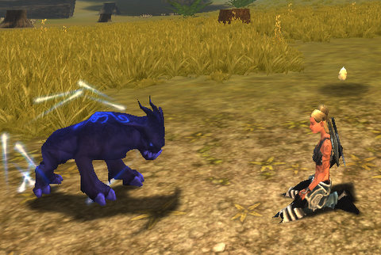

# Chronicles of Spellborn: Adventures in Newbieville

One of the really great things about the open beta is that it is the FIRST time, my time on the EU servers included, where there were enough people running around that it felt like an MMO.

You could go from Hawksmouth City to the docks without happening upon even one Young Bear last night, I kid you not. I'm surprised there were any older bears, seeing as how we completely slaughtered the next generation.

I logged on to Spellborn to find the Void Seer I'd made the night before was gone, so with no older characters to hold me back, I made three new ones: a rogue, a warrior, and a mage.

|  |  |  |
| --- | --- | --- |
|
 sb_client-2009-03-20-21-17-27-04Dina, the Rogue |

 sb_client-2009-03-20-21-17-31-39Nashuya, the Warrior |

 sb_client-2009-03-20-21-17-37-62Tipa, the Mage |

... just to reserve the names. I started off with Tipa, intending to make her into a Rune Mage by and by.

Because the trash mobs were so camped, it took a little longer to reach level 5, where I could choose my discipline. But I didn't get around to heading back into Hawksmouth City until I was well into level 6. Running takes so much time, it's better to complete all the quests in an area before you take long trips.

When I finally made it to the Spellcaster Academy, I was chatting with the Rune Mage instructor and realized that I'd *done* Rune Mage. Sure, only to level 13, but it was *terra cognita* just the same. And I'd just made a Void Seer the night before.

I stood in front of the Ancestral Mage teacher for awhile, then, reluctantly, agreed to follow his path. Now I'll never be lonely. I make my OWN friends!

The client crashed, so I called it a night.

This morning, I headed back in, hoping to finish the Hawksmouth quests so I could move to Aldenvault, where the real fun starts. Well, Quarterstone is where the really real fun starts, I guess.

Anyway. I finished up a couple of quests. People in zone chat were talking about one of the named mobs in the newbie fields, a level 10 boar named Old Winifred, a mean old bird. I knew just where she was, and I was soon grouped with another mage and we were on the hunt.

I was being followed, however, by someone who knew I knew where the boar was... and he tagged it just as my group was about to engage. We killed it, he got the credit somehow.

He did this a couple of times before wandering off. Then we found someone else had her (respawned) on the road. He was level 8, but the battle was not going well for him. Old Winifred saw us, then, and remembering the pain we caused her in her past lives, charged straight at us. Not really wanting to kill her again for someone else's benefit, we ran off, circled back, and now the warrior wanted to group up for the kill.

Great idea! We grouped up and soon had her dead, and the quest completed. Headed back to the city for the turn in, I dinged 7 and was a good way into it. I guess those wanted posted quests are pretty lucrative. We headed out for more named mobs, but after being ambushed by a crowd of higher level Ousted, things went south -- and then my client crashed again.

Those crashes are annoying, but since I have other things to do today, it was just as well.

