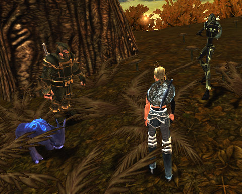
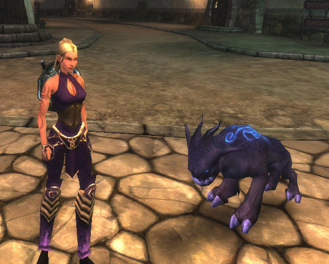

# Chronicles of Spellborn: Grouped!

The Chronicles of Spellborn is a game you can solo, start to end, never having to group. But while it's possible, it's not a really good idea. Some things you can only do in groups -- like the Wanted posters. Those give quests to kill a named mob and give a HUGE amount of experience when you kill them. But if you go it alone at the level you get the quest, you won't last long.

Now that both of us are back from our vacations, Kanad and I joined up last night to bring more terror to the boars and bears of Hawksmouth. He's playing a warrior, me a mage -- when Jalent logged on with his rogue, it miraculously became the perfectly balanced group.

We slaughtered lots of wildlife, Kanad leveled and picked up his Discipline, I finished up some quest lines in the area. When Jalent suggested leaving the overcamped newbie fields to head to the 'next up' zone of Aldenvault, it seemed a good chance to see something relatively new.

Several crashes later, Kanad went to bed and we picked up another mage, name of Demetrius (or something like that). We were just minding our own business, saving a local farmer from [raptor attack](http://www.xkcd.com/135/), when this tiny, tiny hyena started attacking us. He was level 20, but we weren't going to give up.

Even if we were attacked by a dozen raptors during the course of the fight.

Even if we stumbled into an Ousted camp.

I don't know how long the fight lasted. Ten minutes? Easily. Fifteen? Perhaps! For three level 8s to take down a level 20 took a lot of teamwork, a lot of trading off aggro, a lot of close calls.

We finally brought him down. And then we went to the little hamlet in the center of the zone and GOT THE QUEST TO KILL IT. Which, naturally, meant we wouldn't see him the rest of the night.

We tried for another wanted poster. The target was a level 15 crime boss in the middle of a PvP-enabled area. Being only level 8, we were safe from gankage (I think), but a lot of the people hanging around deliberately tried to get in between us and the waves of Ousted.

I closed the night fairly close to level 9. I'll probably head back to Hawksmouth and finish up there before I level.

Fighting all those Ousted left me with LOTS of crafting components; I made a new dagger, new pants and a new tunic and have recipes for several more items. This morning I went to the dye shop and changed my colors to look more like my pet, though they don't have that kind of deep blue. Well, purple is close enough. I guess.

