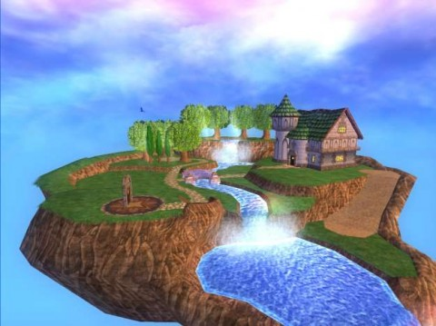

# Wizard 101 unveils player housing!

*Posted by Tipa on 2009-03-26 07:54:53*

Hinted at by [Quinn Hexthief](http://thefriendlynecromancer.blogspot.com/2009/03/quinn-hexthief-rocks-austin-texas-in.html) a couple weeks back, KingsIsle has finally [introduced their player housing](http://mmohub.org/news/GDC%202009:%20First%20Look%20at%20%27Wizard101%27s%27%20Player%20Housing/85/). And it looks FANTASTIC!

I can't WAIT to start building a wizard tower of my own! It will have seven -- no, TEN -- floors, and anybody who wants to visit me will have to battle two to four monsters at once, and they will ALL BE YOUR SCHOOL OF MAGIC! Bwahahaha!

(Thanks to [gamemom](http://twitter.com/gamemom) for the heads up!)

