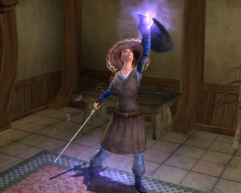
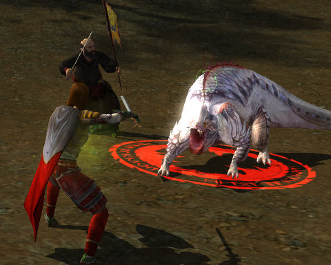

# Lord of the Rings Online: O Capitaine, mon Capitaine

*Posted by Tipa on 2009-03-29 14:30:54*

I've been deliberately avoiding my Captain since I returned to the Lord of the Rings -- she's so much higher level than anyone else I know who plays -- 35 to everyone else's 13-23 -- that it just seemed wrong to not play a lower level character while everyone catches up.

But heck, everyone in my circle of gaming companions is staggering under as large a gameload as I am (and why is that?) so -- hey, look, I have a character who *isn't* looking forward to dreary months soloing in Lone Lands.

Nope, I have one who I logged off after a dreary few days soloing in North Downs, and didn't play again for two years. My Captain!

North Downs has changed a little since the last time I was there. For one thing, Esteldin has moved from the top of the map to somewhere near its center (it is BARELY possible I might have misremembered where it was, but no -- my perfect memory cannot be mistaken). So, all those people I confidently guided to Esteldin by saying top-middle of the map -- sorry, and I hope the Dourhands and spiders weren't too much trouble for you. Since I, of course, knew where the secret Ranger stronghold was (so secret that there was no little banner flag for it on my map), I must have been leading you to certain doom -- on purpose.

You're welcome!

Thanks to the experience boost I received that punted me from level 33 to 35 on my first kill, I was suddenly able to do a bunch of the quests I couldn't find groups for way back when, like wiping out the wild aurochs, just the latest in the chain of quests from the nature-cherishing Rangers that instruct me to kill everything that slithers, crawls, flies, runs, or breathes on the Downs. These Rangers would welcome Saruman, I'm sure. Strip mine the land? Kill all living creatures? Turn the area into a barren wasteland devoid of life! Yes, please!

Apparently the Ranger master plan was to kill all the game in the area so the Orcs and Goblins would be forced to eat the people of Trestlebridge instead.

The senseless slaughter and casual evil of the Rangers was brought home to me in a really fierce way when I was asked by the noble Rangers to not only slaughter some ice wurms and drakes, and to crush their eggs, but to actually return there and find the mother of them all and snuff her out like Gandalf's least-favorite smoking pipe.

I play MMOs, but there is a level below which even I will not go. Rangers, your mindless, indiscriminate evil has driven me away. Sent me off -- to Evendim.

And more on that fateful trip -- another time.

