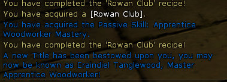

# Lord of the Rings Online: Crafting the Hard Way

It's been bugging me for awhile that my Woodworker, Eraindiel, never mastered apprentice woodworking. She just leveled out of the area too soon, and needed to get making journeyman and now expert weapons -- without mastery, so not as good as they could be, but good enough.

Last night, Windfola was acting up and moving around was difficult, so largely we stayed in the Bree crafting hall. I felt that would be the perfect opportunity to finish off master apprentice woodworking so that at least the journeyman-level weapons I was making for kinsfolk would count.

But what to make to gain the skill the fastest with the least use of resources? The opportunity cost of gathering resources is immense, way more than the cost of crafting an item, so I didn't mind making more things if they took fewer resources.

I scoured the web looking for a good crafting guide that would answer this question, and also cover the topic for all my other crafters as well, and also take advantage of synergies between specialties, for instance in the case of a Weaponsmith, looking for opportunities to level Prospecting and Woodworking as well as Weaponcrafting if points in all three were needed.

I couldn't find such a program. Now the smart thing to do would have just been to pick a recipe and grind it until done. And I would have been done last night before bed.

But instead, I wrote a program. Here's the output. The following four recipes are the most efficient way to level apprentice woodworking, when you don't need points in prospecting or weaponcrafting (but do have a forester handy to gather and treat the wood, as I do).

`goal is 90 points in woodworking`

`Rowan Staff
    9 Rough Leather Wrapping
    18 Rowan Wood
    9 Wax`

`Rowan Great Club
    9 Rough Leather Wrapping
    18 Rowan Wood
    9 Wax`

`Rowan Bow
    9 Spool of Rough Thread
    18 Rowan Wood
    9 Wax`

`Rowan Club
    9 Rough Leather Wrapping
    18 Rowan Wood
    9 Wax`

I actually needed 140 points in apprentice woodworking, but I ran out of wood last night.

Next job: Typing in the Expert Tailoring recipes so I can find the quickest path to Artisan. Or maybe get my Metalsmith, Dera, up to Artisan because Eraindiel will need a new suit soon...

But she already looks pretty cool! Using junk armor to stamp appearance slots, plus some cosmetic items and recipes, makes her look like one bad elf.

