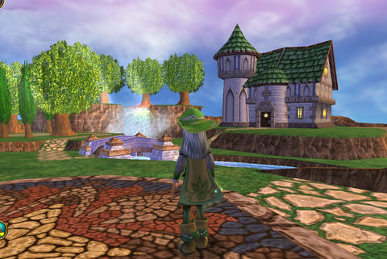
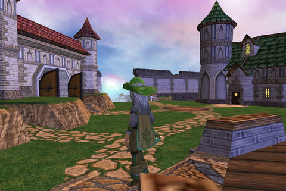
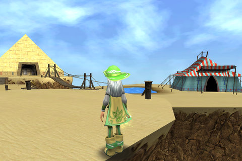
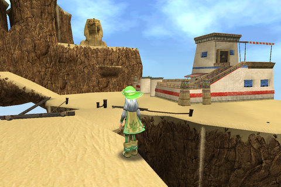
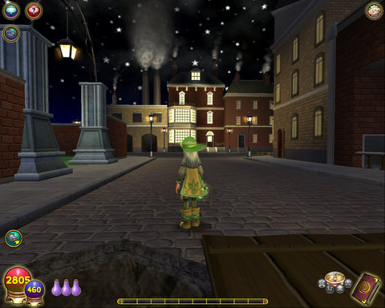
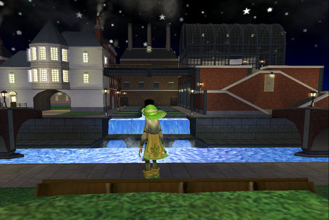
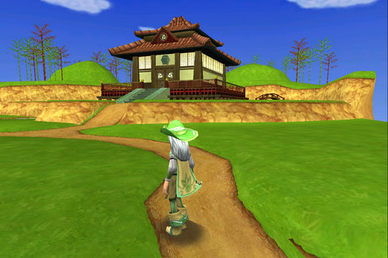
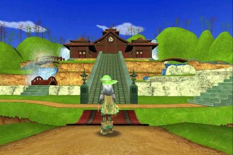
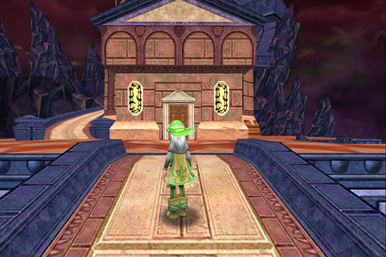
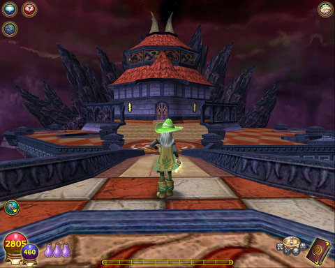

# Wizard 101: All ten player houses

I read on [The Friendly Necromancer's site](http://thefriendlynecromancer.blogspot.com/2009/04/fwd-free-gold-on-test-realm.html) that little leprechauns had appeared all over Wizard City, ready, willing and hoping to give everyone who talked to them 50,000 gold.

So, my excited overspending on [the first night of housing](../index.php/2009/04/23/wizard-101-player-housing-on-test/) on the Test realm, was erased! When I logged in, I found more than that had been erased -- all the characters had been reset, and I had all my original money back but had to buy those islands again.

With the leprechaun's help, I bought ALL TEN homes, just so I could bring them here as sort of a virtual real estate agent's storefront window.

div.x { text-align:center; padding-bottom:10px; font-style:italic; }

  
Wizard City small island

  
Wizard City large island (with theater!)

  
Krokotopia small island (surprisingly roomy tent)

  
Krokotopia large island

  
Marleybone small island

  
Marleybone large island

  
Moo Shu small island

  
Moo Shu large island

  
Dragonspyre small island

  
Dragonspyre large island. It's a tower. You remember Dragonspyre towers, right?

I also noticed a section on the left side of the screen which showed icons of all the stuff you have recently won in battles -- VERY handy if you miss the text after the battle, or can't figure out what that item WAS.

Wizard 101 continues to add features that truly make this, in my opinion, the very best of the Family MMOs.

