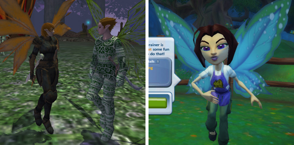

# Can we get back to talking about EverQuest 3 now?

*Posted by Tipa on 2009-04-28 08:08:50*

  
*Will EverQuest 3 be going cartoony?*

Free Realms looks great and I know I'll be playing it for a long while, but I came into this genre playing EverQuest (if you don't count Nexus: Kingdom of the Wind), and I'll leave it playing EverQuest, so now that they have Free Realms out of their system, what's next for ~~our~~ *my* favorite franchise?

One of the things I liked least about EverQuest 2 was that EverQuest still existed. Here I was in EverQuest with several high level characters, and I had to start all over? A lot of EverQuest players said, well, if I have to start over anyway, I might as well do it in World of Warcraft as EverQuest 2. Because they still had EverQuest, you see, for their Norrathian fix.

EverQuest 3 mustn't divide the player base like that. SOE will likely manage that by not releasing EQ3 on the PC at all, instead making it a Playstation 3 exclusive title.

That's a mistake. While EQ has had some success on alternate platforms -- EverQuest Original Adventures for the Playstation 2, EverQuest Mac for the Macintosh -- the heart of the EverQuest community is firmly on the PC.

I think Free Realms might hold the answer, here.

Not that EverQuest should become a collection of minigames. I don't mean that AT ALL.

Well, actually... I totally DO.

EverQuest 2 got off on the wrong foot by competing with EverQuest, hurting both titles. EverQuest 3 should work WITH its predecessors, and not try to replace them.

SOE already has a game, by the way, that builds from and enhances both EverQuest and EverQuest 2. That game is Legends of Norrath, the themed collectible card game built into both games. 

EQ+EQ2+Free Realms+Legends of Norrath = EverQuest 3.

While EQ3 should definitely be a complete and enjoyable experience on its own, it should tie closely in with the earlier games. Free Realms has unlockable, special jobs? EQ3 should do the same. Having a sufficiently leveled adventurer or crafter in EQ1 or EQ2 opens up special prestige classes in EQ3. You can open these special jobs by leveling up some other class in EQ3, but EQ1 and EQ2 players get them from the start. Special jobs could be things like Beastlord, Mount Breeder, etc.

Special items could be craftable only in EverQuest 3, but sent back to characters in EQ and EQ2, similar to the loot items in LoN.

New characters would still start in newbie lands. Fast travel wouldn't get you to any other location until you had traveled there, on foot, from the start, after which you could travel easily, or more easily, between them.

EQ3 shouldn't even start on Norrath. Norrath should be something you EARN. Players should start in the ruins of the dying Demiplanes -- orc/ogre/troll characters in the remnants of the Plane of War, elves in the shreds of the Plane of Growth, and as part of the process, gain the ability to explore Norrath and see how it has evolved since the Gods returned and wiped all the player races from the planet to start over with new, BETTER races.

In EQ, the gods LEFT the world. In EQ2, they returned. In EQ3 -- WE return.

Anyway, just some thoughts.

