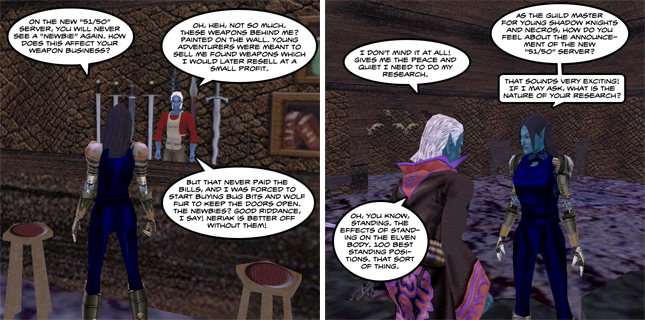

# It's official, the new EverQuest server is chosen, plus EQ3 rumors?

*Posted by Tipa on 2009-05-02 10:05:08*

  
*WK's own Neriak correspondent, Nashuya N'Hamsha, interviews local residents about the new 51/50 server.*

EverQuest dev (and write for the EQ Dev Blog) Clint Worely announced yesterday that all the votes were in -- [the new EverQuest server type has been chosen](http://eqdev.wordpress.com/2009/05/01/what-a-wild-ride/).

[The original poll had several suggestions](../index.php/2009/03/14/everquests-new-server-what-are-the-choices/), including a new regular server, a PvP server, a special rules server and even another progression server similar to but improved over the previous progression servers, The Sleeper and The Combine. The most unexpected option was one for a new "51/50" server, where all new characters would start off at level 51 with 50 AA and presumably some decent starting gear, probably the common Defiant armor that has been dropping since last summer's "Living Legacy" event.

While the support on the forums and other discussion places seemed to favor a new progression server, the devs have been hinting at for quite awhile what they confirmed last week, that the in-game polls had been trending strongly toward the 51/50 server.

Forum participants questioned the wisdom of just asking current players their feelings, as they felt lapsed players would return for a progression server, but they could not offer their views unless they resubscribed.

Clint Worely also announced that he was leaving EverQuest, but wouldn't be going far, "as the world of Norrath has plenty of adventuring left in it for generations to come, so I hope to see all of you in game again in the future!". It's almost certain he is talking about another title in the EverQuest franchise, but whether this means a port of EQ or EQ2 to a different platform or a potential EQ3 is anyone's guess. I choose to believe EQ3, but the hints so far haven't attached a "3" to the "EQ" yet. It is only clear that a new product in the EverQuest lineup is being developed.

