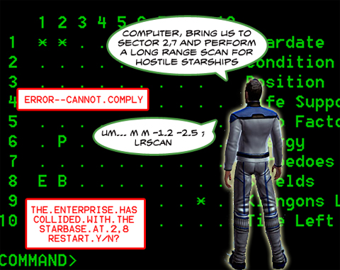

# Star Trek Online -- Tactical Ops

*Posted by Tipa on 2009-05-04 10:00:30*

Recently released screenshots for Cryptic's Star Trek Online give us our first glimpse of the starship interiors and interfaces.

This latest screenshot shows how starship captains will have the ability to construct a Tactical Operations (TACOPS) deck in their ships. Using an intuitive Computer-Aided Decision Interface (CADI), tactical awareness of the current and surrounding sectors may be displayed in a simplified, easily understood manner by the state-of-the-art Situational Bidimensional Character Array (SBCA). The ship may also be entirely controlled from TACOPS with a simplified command syntax, or SCA.

