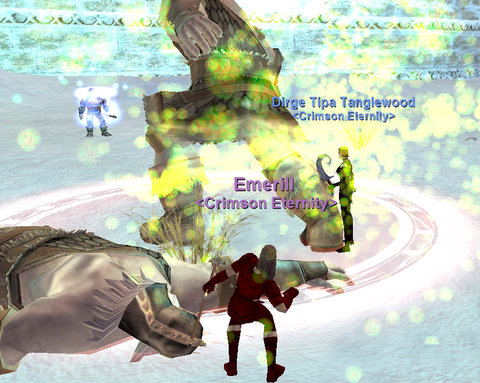

# EQ: Why the new 51/50 server might be great

*Posted by Tipa on 2009-05-05 08:12:45*

Every time I get an urge to play an explorer MMO, I fire up EverQuest, log in to my rogue, the original Tipa Tanglewood, put on hide and sneak and shroud myself in stealth, and head in a random direction, certain to see something I've never seen before, even having played the game for ten years. I was exploring the lands of the Seeds of Destruction and got to chatting with some of my old friends (hi, Carlysle and Netura!) and somehow found myself heading to a group in Valdeholme in the Serpent's Spine, yet another Entirely New Zone for me.

With mercs to tank and help heal, a bard we picked up to pull, and me and Carlysle's monk for dps, we planted ourselves in a nice spot and pulled and chatted and relaxed and had fun and ... omg it's EVERQUEST! There just isn't any other game like it.

I was a raider in EverQuest, but after awhile, raiding is all I ever did. The only way I went to a new zone was if there was a raid there. But I've seen all the newbie zones a million times, and...

I started thinking about how cool it would be to see these higher level zones I've never seen, with all sorts of people around the same level to see it with... The Buried Sea, the Secrets of Faydwer, the Seeds of Destruction. Aside from sneaking through some of those, I've never been. The Serpent's Spine was the last expansion I purchased before I quit EQ.

The forthcoming 51/50 server -- where new characters start off at level 51 with 50 AAs -- would be the perfect opportunity to level up and see the new sights. 50 AAs, though, is way too few; by the time you max out at level 85, you'd want more like 500 AAs to have the basic AAs for your class (AA costs tend to go exponential, so they get eaten up fast).

Still... this could be the very last chance to experience EverQuest as it's meant to be experienced -- on a crowded server with lots of groups your level and a new community.

I'm definitely going to check it out. In 2003, I started a cleric on the new Stromm server, and played that character for the next four years. Last year, I started a new ranger on Luclin with the Nostalgia guild, and had the time of my life for several months.

So I guess the real question is -- rogue or ranger?

