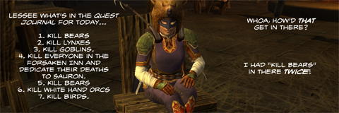

# Daily Blogroll 5/14 -- Going Coconuts edition

*Posted by Tipa on 2009-05-14 07:37:06*

One of the nice things about doing the Daily Blogroll is that it takes the pressure off trying to do something fun every night. Tuesday night, Kasul and I were playing LotRO, running around doing quests in the Lone Lands, and I realized I was bored senseless by the tedium of LotRO's quest grind. Last night was all W101; a friend and I did a couple Moo Shu Onis and then farmed Baron Greebly for cool stuff, and we let each other see our homes. I was playing with a good friend each time, but LotRO's soul-crushing quest grind couldn't be saved. I suspect LotRO won't be on my hard drive much longer. I love the players, but the game is just a grind in pretty clothes.

Speaking of LotRO, Keen read of a survey which talks about [a quite different LotRO than the one we know](http://www.keenandgraev.com/?p=2352). A console based version with more action, players playing both good and evil races, more conflict, more war.... more fun?

[Via Stargrace](http://mmoquests.com/2009/05/14/kurns-tower-to-hit-eq2-finally/). EverQuest 2 will [finally be seeing Kurn's Tower](http://eq2players.station.sony.com/news_archive_content.vm?id=3087§ion=News&locale=en_US)! A couple of Rise of Kunark quest chains led to its door, but not inside. Kurn's was THE premier place to bring your young character in the EQ Kunark era. Lots of places to group, great experience, decent loot, and some cool quests as well. The EQ2 version has a lot to live up to.

Crookshankz spends a little time back near the original Kurn's as he [adventures in EverQuest's Field of Bone](http://thegaminggoob.wordpress.com/2009/05/13/eq-yakety-sax-and-2-questions/). Ah yes, back in the good old days when all you really worried about was how to stay alive.

Beau's back in Vanguard, [looking for that old-time retro magic](http://epicdolls.com/beauturkey/?p=1445) where people didn't see racing to max level as the only possible goal. Vanguard was meant for that kind of player, but will Beau find any kindred spirits in that game?

Order of the Stick goes another strip [without resurrecting Roy](http://www.giantitp.com/comics/oots0653.html). Just thought you'd like to know.

Over on Hardcore Casual, Syncaine's seemingly innocuous article on [giving MMOs credit for the things they do right](http://syncaine.wordpress.com/2009/05/13/giving-credit-when-its-due/) instead of focusing on their missteps turned into a rousing argument in the comments as to why bloggers (and especially Syncaine, a known WoW-buster who writes with all the fervor of an ex-WoW-junkie) are so reluctant to give World of Warcraft its props as the most popular MMO of all time?

And that's nothing compared to the discussion on Ysharros' article i[n praise of the MMO soloer lifestyle](http://stylishcorpse.wordpress.com/2009/05/13/never-the-twain-part-2/)! Welcome back, Ysh!

Openedge1, one of Age of Conan's most outspoken fan and critic, [looks back at a year of AoC](http://simple-n-complex.blogspot.com/2009/05/age-of-conan-retrospect.html), all its ups and downs, and looks to the future to see if it will last a second year. I'm sure Turbine would never cancel a popular franchise [just because of a little dip in popularity](http://www.wired.com/gaming/gamingreviews/commentary/games/2005/12/69848).

Thomas at The Friendly Necromancer looks at the pros and cons (mostly cons) of PvP in Wizard 101, and how [recent spells and other changes to the dueling arena](http://thefriendlynecromancer.blogspot.com/2009/05/pvps-dirty-laundry-list.html) have led to fights being dragged out to SIX HOURS or more. Last time I dueled, it was 4 lv 50s vs 4 wizards around 30 and after an hour and a half we just left. We couldn't see any way the fight could actually end, since the opposing side had a seemingly infinite supply of group rez/heal treasure cards. So W101 PvP is, at the moment, way too broken to enjoy, at least for the 4v4 fights.

And that's about it for today. Fare the well wherever the trade winds take you!

