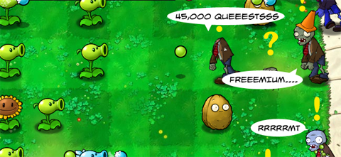

# Daily Blogroll 5/20 -- Hump Day edition!

*Posted by Tipa on 2009-05-20 07:57:40*

So I just applied to a corp in EVE Online. I have so many questions they can help me answer! Like, what's the command to hearth back to the inn? And, are there like space question marks so you know which stations have the quests? And, how do you switch between specs? And, can some high level space dude run me through a couple newbie space dungeons for phat lewts? Hey, did you know that Chuck Norris never uses warp? He just whistles and solar systems come to HIM!

I kid, but you know, people seem to take World of Warcraft for granted. It's hard to see it as most of us saw it for the first time, as a brightly colored world of wonder. [Copra stands in Darnassus](http://bullcopra.blogspot.com/2009/05/step-back-and-take-new-look.html) and wonders why more people don't just take the time to appreciate the game and stop worrying about "xp" and "loot" and "naked night elves". Heck, I'm just kinda jazzed to find out people still go to Darnassus.

Speaking of WoW -- and before I do that, why is Warcraft getting so much flack these days? Twelve MILLION players! And yet everyone seems to want to take potshots ([sorry p@tsh@t](http://potshot.wordpress.com/)) at the most popular video game in the entire world. Green Armadillo points out that Warhammer devs have been blaming Warcraft for [turning out players who don't know how to play an MMO](http://playervsdeveloper.blogspot.com/2009/05/warhammer-faction-balance-finally-hits.html).

Continuing with the assault on WoW, [Syp takes issue with Richard Bartle's gushing love poem to Stranglethorn Vale](http://biobreak.wordpress.com/2009/05/19/make-way-for-us-lowly-gamers/), wondering how Bartle could love so much a zone that players hated so much. My first time through, I liked it fine. Second time through, it was okay. Third time through was a struggle. After that I never went back. I guess I'm not feeling the STV love, either. I guess maybe it's a zone only game designers like.

P@tsh@t and Wilhelm's long-term expedition into wormhole space took another step forward with the [fitting of their covert-ops ship](http://tagn.wordpress.com/2009/05/19/buzzard-no-skill-left-behind/) which will let them peek through a wormhole without getting slaughtered so much by enemies waiting for them on the other side. Feels like Commander Scott's arctic expedition; the full story of death and cannibalism is something we won't hear about for months....

Graktar pointed out in comments yesterday that Warhammer's Land of the Dead flipping isn't quite as dire as I made it out to be. Snafzg says that [yes, it IS that dire](http://snafzg.mmofansites.com/posts/1323-warhammer-online-s-greatest-design-flaw), as with all the population of the winning side in Land of the Dead, there won't be anyone for the other side to fight in order to win their way back. 

I've always liked the old saying that a hardcore gamer is a gamer who plays more than you do, but Tateru Nino has a new definition of [someone who spends more time playing the metagame](http://dwellonit.taterunino.net/2009/05/19/what-actually-is-a-hardcore-gamer-a-definition/) than playing the game. She might have a point there!

See you tomorrow and keep gaming!

