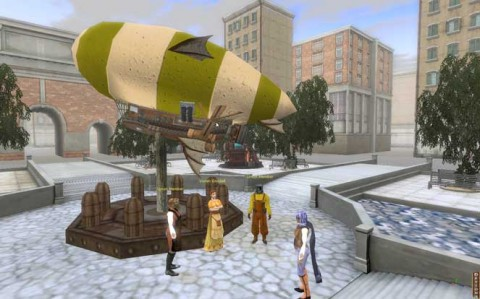

# Steampunk MMO Gatheryn enters closed beta

After the disappointment of finding out that Atlus' NeoSteam wasn't actually very (if at all) Steampunk, it was wonderful to come home today to find that somewhat more authentically Steampunk MMO [Gatheryn](http://www.mindfusegames.com/index.php) has entered closed beta! 

Full details below, but be warned: They are going to ask you about your favorite Steampunk books...!

> Greetings!

Some time ago, you expressed your interest in Gatheryn, a new steampunk-themed casual MMO from Mindfuse Games. We appreciate your enthusiasm, and we would like to thank you for your patience as Gatheryn draws closer to release!

Your continued interest is about to be rewarded, in fact: We at Mindfuse are preparing to start the Beta Testing phase for Gatheryn! As of today, we are opening the registration process to become a beta tester, and as thanks for your early interest and support, we'd like to invite you to be among the very first to sign up. By completing the full registration form, available now, you'll be signing up for an actual Gatheryn account, and you'll get a chance for an early look at the steam-powered Elymian Islands!

You can sign up for your full account, including full access to our new website features, at <http://www.mindfusegames.com/index.php?option=com_user&task=register>

Please note that our Beta Tester selection process is going to occur in waves, with our first rounds of testers playing strictly by invitation. Completing this form will not guarantee you an immediate Beta account. We will, however, be giving consideration to our earliest supporters, so sign up now, and thanks once again for your interest in Gatheryn!

In addition, please have a look at our all-new website, online now at <http://www.mindfusegames.com>.

Cheers,
Silas Gray -- Elymian Ambassador to OutWorld

See you in the Elymian Islands (I hope!)

