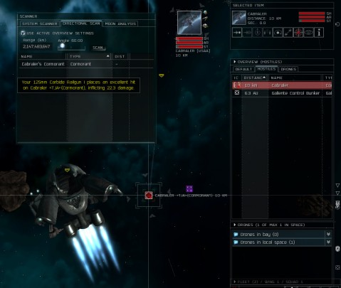

# EVE Online: Preying on the Weak

  
Click to make this larger

Tracker Wolf has taken it upon himself to teach this noob the basics of PvP in EVE Online. The game is pretty complicated to begin with, but PvP is like lifting up the control panel for Boeing 747 and finding the controls for the space shuttle underneath.

Hanging in a safe spot deep within lowsec, narrowing in on lone pilots using half intuitive, half trial and error pings from the system scanner? Done that. Bringing up information about the pilot and their ship, length of play, corporation and so forth to see how likely they are to put up a fight? Done that.

Swooped in like an angel of death, warp scrambler pinning them in place while drones and missiles slam into their hull again and again?

Done that.

I'm not really a killer, and mostly (when Tracker Wolf asked after) I just felt kinda bad for the guy. He'd just killed a couple of rats, was in a destroyer but clearly damaged, and then WE swoop in like vultures and rip him apart. I didn't want to pod him, because everyone loses ships, but podding someone is just being mean.

But hanging motionless in deadspace in the Tin Empress (my PvP Tristan), using an imperfect tool like the system scanner to place someone in the vastness of the system -- now THAT'S cool. Like being the submarine person who has to listen for the tell-tale cavitation of the propellers of enemy ships to guess if they are the hunters or the hunted. In lowsec, you are both.

Fate had its way with me later on, as a sudden swarm of NPCs tore my Catalyst, Corner Time Out, apart on a mission. I'd refit my salvager as a mission runner/salvager so that I wouldn't have to always be swapping ships, and it had been working out fine until I met the Morgun. I wasn't prepared for how quickly they could take apart my shields -- and plus, I was webbed. I went back with my PvE Tristan, Isis' Dark Laughter, but just barely escaped before that ship was also blown away.

So tonight I will just lie low, I think, and let the last skill I need before I can fly my Retriever mining barge finish training. Sunday starts the training for the Vexor, but before I get that, I need to fit another mission Catalyst -- one that can tank a little better. Tracker Wolf sent me a couple PvP Tristan builds, so the Empress will likely be getting an upgrade as well.

