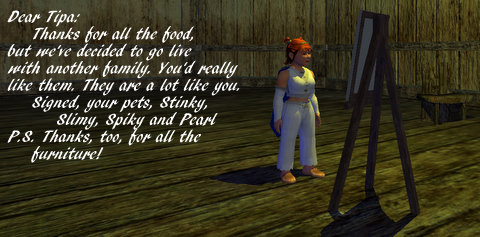

# Daily Blogroll 5/29 -- Reasons to be Cheerful, Pt III

Welcome to another Friday! Got plans for the weekend? I'm planning to take a short break from EVE Online and get caught up on a beta, Mabinogi, Wizard 101 and will reinstall EQ2 to see if that fixes the problems I'm having with it freezing on launch.

Spinks starts us off with a long and detailed look [at the power of story in MMOs](http://spinksville.wordpress.com/2009/05/29/howling-fjord-sins-of-the-fathers/), specifically, the plight of the Forsaken as they meet their maker in World of Warcraft's Howling Fjord. Those Forsaken aren't dead, they're just pining for the fjords!

Openedge1 [hits the wall in Age of Conan](http://simple-n-complex.blogspot.com/2009/05/age-of-conan-grinding-for-2-hours-day.html) as he creeps up on level 80, currently the maximum level in the game. Is reaching max level worth spending days or weeks of nightly grinding? Or is it just time to take a break and play something purely for fun?

That's a good question. Why do you play an MMO past the point where you are having fun? Or do you just move on to something else?

Caliga has [a first look at the Ether Saga Online F2P MMO](http://mmogamers.freeblogit.com/2009/05/28/ether-saga-online-open-beta/), which turns the cutesy dial to 11. My teeth hurt just looking at the screens. Ether Saga will be published by Perfect World International, who are also publishing Runic Games' action RPG (and associated future MMO) Torchlight.

Ever get deep into a fight in Wizard 101 and just want to end the darn battle so you can get on with your life? I have, WAY too many times. Thomas, the Friendly Necromancer, has found [a Wizard 101 Damage Calculator](http://thefriendlynecromancer.blogspot.com/2009/05/wizard101-damage-calculator.html) that will show you if the cards in your hand are enough to blast that boss back to Nightside, or if you need to give it just a little more oomph. VERY handy.

It's great to see people returning to the EverQuests. Not that WoW isn't a great game -- it clearly is -- but I think there are other MMOs out there that are pretty great as well :) Angry Raider has been using the EQ2 Refer-a-Friend program to powerlevel various characters to decent levels and [explore the vast world of Norrath](http://www.angryraider.com/archives/116). But can he take playing an angry fairy dirge?

Meanwhile, Hudson has finally realized what we Nostalgians figured out last year, that it doesn't make much sense to go looking for a game that plays like EverQuest when you have the real thing RIGHT THERE! [Another EverQuest blogger? WONDERFUL!](http://hudshideout.com/blog/?p=2560) I plan to return to EQ as well, but I'll be doing it with the 51/50 server, just to see what that's like. EQ crowded with people is the most amazing thing ever.

Meanwhile, Syp is over in the Lone Lands working through the ruins and watching Hunters flee past him at warpspeed. Hunter can't take a hit? [Syp's Captain likes a good fight](http://biobreak.wordpress.com/2009/05/28/lotro-i-am-hero/)!

Ogrebears [doesn't agree with me](http://ogrebear.com/?p=993) that EQ3 (if there is such a game) [would be built on the Free Realms engine](../index.php/2009/05/28/will-everquest-iii-be-free-realms-ii/) because the constant hits of endless and continual downloading as the game streams to the player would be a deal-killer. Well, I dunno. They could stream it in larger chunks. Wizard 101 does a similar streaming thing, and though there are delays when you open a new area, it's not too bad and it's only once.

Damion of Zen of Design [examines how EVE Online keeps growing](http://www.zenofdesign.com/2009/05/28/eves-slow-burn/), while most MMOs have a spike-and-fall subscription model. Make a unique game, don't try to chase trends, keep your vision and play the underdog. EVE Online has more subscribers that Warhammer, EQ, or EQ2, is likely closing in on LotRO, and still keeps that indie niche game cred. How does it do it?

Snafzg has [an advance look at the Aion Collectors box set](http://snafzg.mmofansites.com/posts/1348-aion-collector-s-edition-details) and all the special secret prizes you get for your extra twenty bucks. That action figure may look cool, but can you play Monopoly with it? I am definitely looking forward to Aion, it looks unique and wonderful.

And lastly, Werit says everyone is asking for broader content in their MMO instead of just race-to-max-level, achievement-based content, but when Mythic gave them exactly that in Warhammer Online, what did they do? [Ignored the broad content for the race-to-max-level stuff](http://werit.blogspot.com/2009/05/vertical-progression.html). Just can't win for losing some days.

Enjoy your Friday, have a great weekend and see you Monday on the Daily Blogroll!

