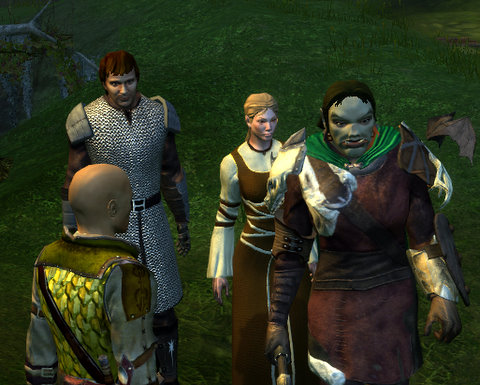

# Neverwinter Nights 2

Out of nowhere, I was invited to take part in a weekly online gaming group as they explore the world of Neverwinter Nights 2 (which, it turns out, is an entirely separate game from Neverwinter Nights Platinum). I'd originally bought NWN2 to play with its level editor, but I never really learned it well enough to bring it all together. The levels seemed a lot smaller, for example, than I'd have liked. Smaller than in Neverwinter Nights, even.

I'd never actually played the game because, well, I'd gotten stuck in the tutorial. If I remember right, I couldn't survive the general brawl event.

When I re=installed it last week, I figured this would be my litmus test: If I could figure out the tutorial and complete all the objectives, I'd be on my way.

This time, I got stuck in the magic tutorial, because, it turns out, I didn't read the tutorial text in the popup. I'm just so USED to hitting "OK" "DONE" "COMPLETE" "GO AWAY YOU DAMN BOX" on every popup window that the idea that such windows may contain useful information is entirely foreign to me.

So try #3, last night, I actually read all the boxes and figure out the tutorial. The fact that I chose a HUGE half-orc barbarian for a character instead of a willowy elf or a tiny hobbit turned out to help a little in the general brawl, but I was of somewhat less use because it wasn't entirely clear who the good guys vs the bad guys were, and I was having trouble moving around and having to click to select the baddies was getting tiresome.

As I'm writing this, I understand, finally, that MMOs, with all their time-saving conveniences, have trained me to approach RPG combat in exactly the same way, every time. Little use of the mouse, a camera which acts intelligently, tab-target-attack till it's done. I was also unready for auto-attack -- in EQ2, if you aren't pressing a button, you're not doing your job.

I have no idea what it'll be like to play NWN2 with other people....

Time to reinstall Vent!

