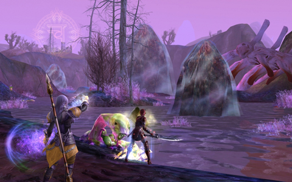

# The Players of Aion

The NDA for Aion prevents me from saying anything specific about the game; press doesn't face these same limitations, so you can read some impressions [at Massively and other places](http://www.massively.com/2009/06/07/hands-on-with-the-aion-beta-becoming-a-daeva/), and I'll give my own impressions when I can. Having an NDA when there's a million people playing is kinda weird, but I'll stand by the agreement I clicked upon.

But there's no NDA that tells me I can't talk about the players.

Take one step into the world of Aion, and from that moment on, you're an expert player. All your years playing MMOs has prepared you for this moment, and nothing you encounter will give you a moment's hesitation. By the end of the preview Sunday, many characters were fairly high level, guilds had been set up and there was a rough hierarchy of achiever guilds vs casual, friend-based guilds.

Every quest hub had player vendors hawking their wares, competing with each other on price and selection and in most cases, using work-arounds in order to get profanity through the filters and into their advertising message "come here for the best sheet".

There were the soloers, there were the two-three person groups, and there were the full groups already tearing into the tougher content most players won't see for awhile.

That's Aion, the game you already know how to play. And because it's so familiar, it's extremely enticing. When I logged off Sunday, it's because the game had grown concerned that I had spent so much time online.

More when the NDA drops.

