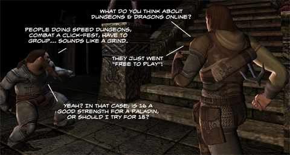

# Nightly Blogroll 6/09 -- Freemium Edition

It started out like a normal day. Then [Turbine announced](http://www.ddo.com/news/547-turbiner-announces-dungeons-a-dragons-onliner-eberron-unlimited) that it's [Dungeons & Dragons Online MMO](http://www.ddo.com/) was going Free to Play, and Twitter ignited and MMO bloggers the world over ran [to](http://www.massively.com/2009/06/09/ddo-adds-free-to-play-with-eberron-unlimited/) [their](http://www.killtenrats.com/2009/06/09/new-ddo-business-model/) [keyboards](http://pumpingirony.net/2009/06/09/ddo-eberron-unlimited/) [to](http://mmomentofzen.blogspot.com/2009/06/ddo-goes-free-to-play-sony-to-follow.html) [pound](http://commonsensegamer.com/?p=1356) [out](http://epicdolls.com/beauturkey/?p=1565) [the](http://biobreak.wordpress.com/2009/06/09/announcement-ddo-f2p/) [news](http://biobreak.wordpress.com/2009/06/09/ddo-unlimited-gets-an-explanation/). Subscribers were now VIPs! And the new "unlimited" players were (by comparison) NVIPs! Or VUIPs! (Sorry if I didn't link to the announcement on *your* blog; after awhile I stopped saving the announcements).

All I can think of is how a couple of drinks makes anyone look good in a musty bar. You didn't care much for DDO when she thought herself just as good as all the other girls, but now that she's lowered herself, she's good enough for a quick spin in the alley? Well, if it keeps the servers running, I guess it's a good thing. With the shuttering of Matrix Online and the revamping of the DDO business model, many are expecting Vanguard and EQ2 to go Free to Play.

Hudson reports that D&D-compatible RPG Neverwinter Nights may be jumping to the MMO arena, on rumors that [Atari bought Cryptic primarily to do the deed](http://hudshideout.com/blog/?p=2640) after they finish with Champions and Star Trek Online. I guess it makes sense to make another D&D-based MMO since D&D Online has done so well thus far. No, wait. It DOESN'T make sense. Making a second D&D MMO would be just as silly as making a second, oh, [STAR WARS MMO](http://biobreak.wordpress.com/2009/06/09/star-wars-class-speculation/)!

Speaking of Star Wars: Galaxies, looks like there's [an opening for a new Community Manager](http://www.brokentoys.org/2009/06/09/customer-service-is-hard/). I bet everyone working at SOE lifted their heads from their computers when they heard the *SNAP*, nodded once or twice and went back to their work.

But hey, he was pushed, and pushed HARD. But you know, people on the Internet, they don't care what they say. Everyone can be who they want to be, [say whatever they feel like saying](http://www.killtenrats.com/2009/06/09/the-horrors-of-free-chat/). Ixobelle [tries to explain to a white supremacist](http://www.ixobelle.com/2009/06/where-ixo-rps-being-black.html) in WoW chat that a lot of his in-game friends might actually be a different shade, with predictable results. Warning: That link is DEFINITELY "NSFW".

Speaking of WoW, it's gotta be hard to be the #1 game worldwide, because everyone wants to be there when you fall. Wolshead [looks at the Alexa rankings of the World of Warcraft official site](http://www.wolfsheadonline.com/?p=2217) and sees a steady decline in interest, and others see similar signs in the [increasingly vague Blizzard press releases](http://ihaspc.com/?p=420). Ryan Shwayder declares [he's finally found the fabled WoW-killer](http://www.nerfbat.com/2009/06/09/i-found-the-wow-killer/) -- WoW itself.

Maybe. But maybe the whole thing is like "[peak oil](http://en.wikipedia.org/wiki/Predicting_the_timing_of_peak_oil)" -- different groups look at the same set of numbers, but draw opposite conclusions. One thing is certain, though -- they aren't about to dig up another 11.627 million players (a new world record!) for their game. They have to be focusing purely on keeping the ones they have until the new MMO is ready to go.

Ya think ya know someone, and it turns out that they're really a red-eyed screaming ghoul (and if you don't know where that line comes from by now... look it up!). Yup, [Beau Turkey has landed in Darkfall](http://epicdolls.com/beauturkey/?p=1558) and likes what he sees, becoming only [the second blogger Syncaine respects](http://syncaine.wordpress.com/2009/06/09/the-lost-darkfall-eurogamer-review-is-found/). 

All around the world, [the sheep look up](http://en.wikipedia.org/wiki/The_Sheep_Look_Up).

