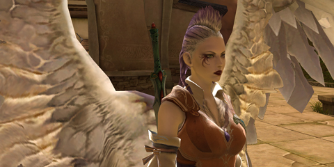
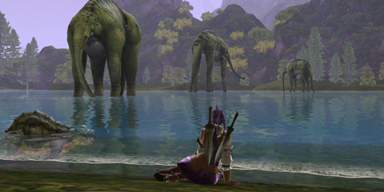
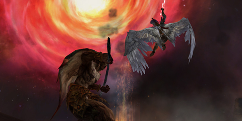

# A first look at Aion: The Tower of Eternity

*Posted by Tipa on 2009-06-16 21:25:54*

Aion is not an innovative MMO. Anybody will tell you that.

You have your quest hubs with quest givers who task you with killing everything in the vicinity. Classes start off with four archetypes (scout, mage, priest, and warrior) and split at level 10 into eight subclasses (ranger, assassin, chanter[shaman], cleric, gladiator[berserker], templar[paladin], spiritmaster[mage pet class], and sorceror[wizard]).

And these work exactly as you might expect, in essence. Sure, there's a whole combo tree where you can buy and equip skills to make devastating combos, but since they kindly have made a one button combo system -- you hit the start combo ability, and then hit it again for the next ability in the combo, and so on -- you usually aren't pressing more than a couple of buttons. You never actually stop pressing buttons.

But I don't really want to get into the mechanics of the game. You can point to pretty much anything in Aion and say, I remember that from World of Warcraft, and this thing is just like it is from EverQuest II, and this feature is totally right out of Lord of the Rings Online.

That's the number one thing I have heard about Aion -- it's just like every other game, so why play?

Uncomfortable truth time, folks. Innovation does not do well in the marketplace. Blizzard proved with WoW that you can do without innovation if you give a polished experience and give people what they want.

Aion is so polished that it gleams. Every inch and corner of the place is filled with nice little touches -- like the pool in the corner of one of the starter regions (seamless world, of course) that has a dryad there who will leave you alone if you leave her alone. People were gathered at it, probably on some quest I hadn't gotten, but -- it was so immersive.

That picture up above -- those massive creatures? The first time I saw them, it was in the distance as I was testing out my wings for the first time. They were so far away, I wasn't sure if they were weird trees or rock formations or what they were. Somewhat later, a quest sent me to that area and there they were, immense, moving around slightly, they didn't care about anything but grazing at the river head.

This is the most immersive game since the original EverQuest. Not just because of the graphics -- though they are superb, just a little more ethereal than normal and far, far from the cartoony weirdness of WoW. Aion is immersive because every part fits together with every other part. The NPCs move around and inhabit their world, and this is a world worth inhabiting.

And yes, you get to fly.

Now and then you come to cut scenes -- for completing an important quest chain, Ascending to become a Daeva and earning your wings, or remembering how you came to be cast down from Heaven to live among mortals for a time -- and they are beautiful, and they make you want to level up and head back into the Abyss to bring the hurt to the creatures that cast you out.

That's the real meat of Aion. You start out on your own half of this shattered world -- the angelic Elyos on the bottom half, the demonic Asmodians on the upper -- and between them, at the core, is the Abyss. Ownership of the fortresses in the Abyss shifts according to the PvP battles, and those in control can levy taxes on the merchants in their realms. There is a third, NPC race, native to the Abyss, and they were the ones that shattered the world. I'm not sure if they take part in the faction control, but I wouldn't be surprised if they aided the weaker faction.

WoW took ideas from Ultima Online, EverQuest (mostly) and Dark Age of Camelot, and made them into a single game that was greater than them all. That's all Aion is doing here.

And hey, you get to fly. That's gotta be worth something.

