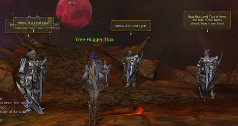

# Daily Blogroll 6/18 -- Fun with your new Brad edition

A few days ago, the MMO blogging world burned with the news that rock star MMO developer turned lonely exile, Brad McQuaid, had returned from his lonely, sparse existence of [playing video games, racing cars and sports bikes](http://www.bradmcquaid.com/Brad_McQuaid/Blog/Entries/2009/6/14_Where_the_heck_have_you_been.html) and feeling sorry about the harsh hand life dealt him to [urge people to play more Vanguard](http://www.bradmcquaid.com/Brad_McQuaid/Blog/Entries/2009/6/16_Silius_and_the_current_VG_Team.html). Some people were skeptical, [but have come to believe](http://www.thegrouchygamer.com/?p=192). Others [forgive him for his sins](http://ardwulfslair.wordpress.com/2009/06/17/forgiving-brad-mcquaid/). 

But you know? If that's really Brad, well, he's coming off as kind of a jerk in his postings, but I don't feel he has really done anything more than be a human.

Brian Green of Psychochild's Blog writes a little about the differences between [making money in the real world and making money in World of Warcraft](http://www.psychochild.org/?p=725), as promoted by [Gevlon the Greedy Goblin](http://greedygoblin.blogspot.com/), who is apparently a sociopath. The way to success in real life, says Gevlon, can be taught by bilking naive [M&S's](#) of their gold. Not so fast, says Brian. The real world is more fun than that.

Thomas the Friendly Necromancer has compiled a list of [all 817 items available via quests, boss fights or just walking around](http://thefriendlynecromancer.blogspot.com/2009/06/complete-housing-item-list.html) with which to turn your home into a place of awe and comfort. That's pretty impressive! The Evil Theurgist, by the way, [has spotted what looks like an additional two potion bottles](http://eviltheurgists.blogspot.com/2009/06/new-facebook-update.html) in a Wizard 101 video. Does that mean Grizzleheim will bring more levels? The delayed push to the Test server will tell us -- next week.

Recently returned-to-Dungeons & Dragons Online cleric Syp [discovers that pickup groups are pretty much the same everywhere](http://biobreak.wordpress.com/2009/06/17/completely-losing-it/), and why it's so hard to find people to play healers when it's clear they are among the most desired of archetypes. People in pickup groups feel free to do anything, because they know they can always blame the healer when things go wrong. 

I still wake up at nights with my skin cold remembering pickup groups as a WoW priest. If someone says "Blackrock Depths" anywhere near me -- okay, please, please don't.

EQ2's game update 52 brought a whole new quest series to the game leading up to the opening of the ice continent of Velious in the next expansion. Ogrebears has gone through one of them, the [Order of Rime quests in Kylong Plains](http://ogrebear.com/?p=1087). Kody at Curse Gaming has unearthed the names of that expansion -- [Sentinel's Fate](http://www.curse.com/articles/sony-online-entertainment-en-news/500630.aspx). 

In the same post, Kody names the next EverQuest expansion as "Underfoot". The Plane of Underfoot was the realm of the god Brell Serillis that bled through the Living Wall in the Hole to destroy the evil city of Old Paineel in times past. So it's good to see we might finally be able to travel to the other side of that mysterious gate.

Is it possible to Rickroll an entire server? [Stargrace says yes, yes it is](http://mmoquests.com/2009/06/17/the-ultimate-eq2-rickroll/), but the jokers soon found out that if you play with fire, [you're gonna get burned](http://tinyurl.com/2w4apm).

A lot of people, myself included, are oooh-ing and aaah-ing over [Aion's distillation of a bunch of MMO tropes into a new and exciting mix](http://www.keenandgraev.com/?p=2585), but are we all just succumbing to the sort of hype that caused so much turmoil last year? Hudson warns that [looks alone won't sell a new game](http://hudshideout.com/blog/?p=2695), and the actual play could be just the same old grind.

Syncaine wonders why they don't just let veteran WoW players start at or near max level, [and have special newbie servers for new players](http://syncaine.wordpress.com/2009/06/17/why-do-we-still-force-alts-to-re-grind-and-what-about-the-new-guy/) or those who want to experience abandoned older content with other people? He has a point -- the day is coming when a new player will ding level 2, say to themselves, "great, just 98 more levels until I can do all the stuff I keep reading about," and log off forever. 

Lastly, beta invites for city-building MMO Cities XL have started going out, and [Massively has beta keys for you](http://www.massively.com/2009/06/18/win-your-very-own-cities-xl-beta-key-through-massively/). Better get started with the construction. I hereby claim Dubai as a city name...

Hey, it's Thursday, so if you hear Thor, the god of thunder, rumbling up in the sky, hold your clenched fist high as you rush bravely into battle -- or wherever your day takes you.

