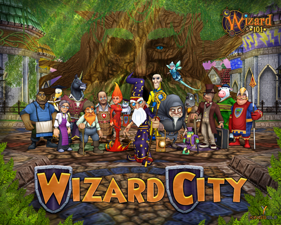

# *EXCLUSIVE* Wizard 101 wallpaper!

***
**EDIT**: I apologize -- the service I used to host the wallpaper instead shrunk it. I have replaced that link with a link to the full sized, 1280x1024 version.***

I got a shocking letter from Fernando Blanco of KingsIsle today. As a thank you gift for all the Wizard 101 players who read my blog, the artists have drawn up a "cast list" of all the faculty and staff at the Ravenwood School for the Magical Arts... look closely, because if I'm guessing right, Wizard 101 Director J. Todd Coleman himself (or someone who looks a lot like him) sneaked in while they were gathering for the photograph (see if you can pick him out)!

Click on the smaller picture above to view or download it at its full 1280x1024 size.

And yes, this is my desktop wallpaper now :)

Enjoy!

