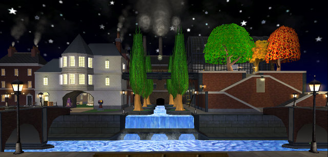
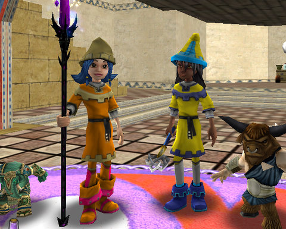

# Wizard 101: First Night in Grizzleheim & Crafting Secrets

*Posted by Tipa on 2009-07-02 07:04:04*

I probably shouldn't have titled this post "First Night in Grizzleheim", because I hardly went there after doing the quests to open it. At 50, Tara doesn't get any experience rewards from defeating monsters or completing quests, nor are any of the gear rewards any upgrade, so she has no reason to go. Allison, my Balance wizard on my second account, just hit 30 and is a perfect level for Grizzleheim -- but she's been partnering with my level 13 Myth alt, Marissa. And level 13 is too low for Grizzleheim -- she can't get any of the quests yet.

 So, I explored all the OTHER things that came new with the expansion, instead.

First, top of the page, the sprawling neighborhood of the Marleybone Royal Estate. The new Bazaar makes it easy to overindulge on house items, and combined with the loot she was siphoning from Marissa's completed quests and monster drops, and her own equipment, she'd outgrown the modest Marleybone mansion where once she dwelt.

Next down, Tara proudly bears her "Apprentice Crafter" badge. This took awhile, not because harvesting takes too long (more on that later), but because the cooldowns on the crafting slots is so onerous. Thankfully, they want fewer items made for the first tier than they did on the test realm. But it's still pretty bad. I'm working on the Marleybone crafting quests now -- five rings and five athames for the FIRST quest, and each takes an astonishing number of harvests.

EVERYTHING takes an astonishing amount of harvests. Crafting would be utterly impossible if there weren't a trick to harvesting, and here it is. Enjoy it before KingsIsle nerfs it :)

First, find a place AWAY FROM OTHER PEOPLE where a harvest spawns. I like the room outside King Djesserit's Chamber in the Djesserit Tomb in the Temple of Storms in Krokotopia for Stone Blocks and Parchment. There are two Stone Block spawns and two Parchment spawns in that room, and there is a third Parchment spawn in his chamber, along with a possibility of two Wooden Chests, one in each room.

Start in the Ambrose realm. Check out the room, harvest anything you find, then switch realms to the next one down -- Bartleby, or whatever. Continue this until you have enough. You can speed this up with a partner checking realms, too, since you can port to someone in a different realm even if your realm change cooldown timer is still running.

I got all the Cattails and Ore I would need in the Cave of Sorrow in Moo Shu, and Newgate Prison gave me enough Deep Mushrooms to fry a hundred steaks.

I haven't found a good place for Mist Wood yet. I got the bare minimum from just running through Moo Shu's wooded areas (Grizzleheim may come to the rescue, here). And Marleybone crafting needs metric tonnes of scrap iron. I haven't found any of that yet.

The key here is to hang out in an isolated area. Other wizards will harvest whatever they come across. The guides on Wizard 101 Central point people to highly populated areas to harvest. That leads only to frustration. Harvesting is a solitary activity.

While waiting on crafting cooldowns, I took Allison and Marissa back to Wizard City to finish some quests. Since Allison has been Tara's constant companion through Moo Shu and Dragonspyre, she has leveled to 30 mostly by doing high level quests and instances and actually never -- tis sad but true -- even finished Wizard City. And Marissa needs everything, so last night, both wizards received the Three Streets Savior badge for brave deeds in Wizard City, finished their quest robes (pictured), and are poised on the edge of Colossus Blvd and the Sunken City before moving on to Krokotopia.

When Marissa turns 15 in two levels, I'll see if Grizzleheim has opened up for her. If so, I'll start mixing in those quests along with Krokotopia.

I spent some time in the Bazaar looking for fire resist gear. If I could get fire resistance up past 100%, Malistaire's devastating attacks couldn't touch me. Sadly, I was only able to get unbuffed FR up to about 45% -- far short of what I'd need. I haven't yet found anything that will ameliorate his meteor storm, but I'm working on crafting precisely because I think there is something that a master craftsman can make that will help. The forge RIGHT OUTSIDE Malistaire's instance is an obvious clue.

The sad thing about crafting, and what I hope most they will change, is that crafters cannot be fairly compensated for the things they make. Either they use their crafted items for themselves or their alts, or sell them for a fixed price on the Bazaar. And I assure you, the vast material requirements for the highest level crafted gear far outstrip the meager price you can get for them in the Bazaar.

The Bazaar is a good first attempt. But it is not a rewarding experience, and by a rewarding experience, I mean one that results in gold. In a non-managed Bazaar, wizards who harvest what they come across could then sell these items in the Bazaar at a price they set, and the prices for these resources would quickly reach a natural level, quite higher than what they are today. Crafters would buy these resources at inflated prices so they wouldn't have to go out and harvest on their own. The harvesting wizards would make good amounts of money, and the high cost of materials would tend to keep dabblers out of crafting and more inclined to sell their harvests.

Crafters could then make items and sell them for their natural price, which would likely be below the cost of materials in most cases. People looking for unique gear or home furnishings would have the chance to buy items they normally could never see, as currently, there is absolutely zero incentive for a crafter to make something for anyone's use but their own.

A managed market is never a good thing. An open market could spark a thriving community of artisans. It's just that simple.

