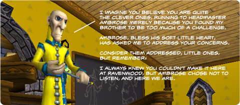

# Wizard 101: Cyrus Drake apologizes for difficult boss encounters

*Posted by Tipa on 2009-07-03 15:34:38*

Along with Grizzleheim, the folks at KingsIsle introduced new boss battles more along the lines of bosses from traditional MMOs like World of Warcraft or EverQuest II, which required specific strategies to defeat.

In particular, the fight against Malistaire went from a rather ordinary fight to [one requiring a quite specific strategy](http://www.wizard101central.com/forums/showthread.php?t=16820). I personally believe we haven't yet found the strategy the designers intended, as there are no (or very few) master crafters. But nonetheless, the folks at KI have decided to give these encounters another look. The picture above has what I imagine Drake really WANTS to say, but what he ACTUALLY says is:

> Hello students...

I am hearing loud and clear the message that many of you do not approve of the enhanced boss fights, or at least the way in which they were implemented. 

The idea behind these was not to make the game more "hardcore", more difficult or to make it impossible to group. We simply wanted those encounters to be more interesting than 1. Defeat Monster, 2. Collect Loot. Each of the bosses we changed had a twist on normal combat, or required a specific strategy to be employed, like a puzzle. 

Rest assured, we have heard your displeasure, and we will re-visit the boss fights very soon.

Cyrus Drake 
Professor of Myth 
Ravenwood School of Magical Arts 
En Magus Nos Fides

So there you have it.

---

I noticed that the folks at Wizard 101 Central had a poll up asking [what sort of mounts wizards would like to see added to the game](http://www.wizard101central.com/forums/showthread.php?t=17186). Mounts? And "magic broom" is not in the list? "Speed boots", which ARE in the list, are already in the game, too. But nobody is going to swap gear to run slightly faster.

---

Lastly, [KingsIsle wants you to get into the indie movie making business](https://www.wizard101.com/site/home2/wizard101/page_8ad6a4042235834c0122381534c45673). because they know you're out there on the streets, keeping it real, living the life.

If you got something to say, why not say it right to Ambrose and Gamma as they peer into their crystal ball? Take the (now correct) "green screen" video given, put your own video into the crystall ball and supply your own commentary via Ambrose and Gamma's dialogue, and post it for the world to see.

Fame awaits, are you up for the challenge?

