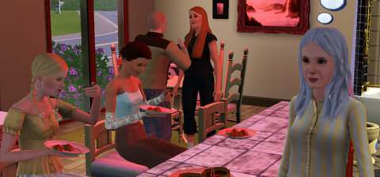

# Sims 3: Alice comes for a visit

Awhile back I gave the renowned homeless family whose story is chronicled in [Alice and Kev](http://aliceandkev.wordpress.com/) a lot of their own in my Sims 3 town. I check in on them now and again, thinking of excuses to visit their lot. Alice never wants to visit, but I have the Party Animal ability to force people to come to my parties and have fun. Handy little ability, that. Anyone I invite, has to attend.

It's a great way to see that Alice gets fed, anyway. That's her eating Dim Sum, second from the left, well into her Young Adult phase, a fair distance from her beginnings as [a young girl with an abusive dad](http://aliceandkev.wordpress.com/2009/06/09/alice-and-kev/).
