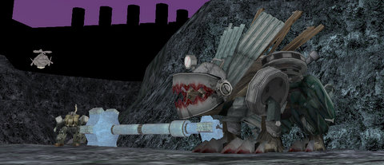

# Daily Blogroll 7/21 -- Scrapyard edition

*Posted by Tipa on 2009-07-21 08:03:07*

I almost resubscribed to WoW last night. Just for a month, just so I could see some of the new places, see if the stuff the expansions added changed the game for the better. I didn't, though, because to roll up a Death Knight and see all this cool stuff would cost me $$$ for the core game, Burning Crusade, and Wrath of the Lich King. Maybe when Blizzard finally makes all-in-one editions, [like everyone else these days](http://everquest2.station.sony.com/buyNow.vm).

Ack, there I go, comparing WoW and EQ2. I should learn to leave that to the professionals, like Wolfshead, whose first note on why WoW is better than EQ2: [WoW has a smaller ESRB](http://www.wolfsheadonline.com/?p=2570) warning. As an EQ2 player and recovering WoW player ([you're never an EX-WoW player, just recovering](http://notadiary.typepad.com/mysticworlds/2009/07/trio-.html). They teach us that in Warcrafters Anonymous), I naturally feel protective of my chosen game and could, if I wanted, spend a few minutes refuting that post. But it's okay. Syp tells me [not to take it personally](http://biobreak.wordpress.com/2009/07/21/criticism/).

Spinks writes of Zoltan, the WoW player who is a better person than you. All men want to be him, all women want to be his, because he is [the best Achiever in the entire world](http://spinksville.wordpress.com/2009/07/21/is-this-man-the-best-wow-player-in-the-world/). All around the Earth, millions of people feel a darkening in their soul as they realize they should have spent more time playing WoW.

Seems everyone is on WoW's case these days. Stingite at Friendly Necromancer took yesterday's apologia from Wizard 101's Cyrus Drake about releasing the latest expansion, Grizzleheim, [as a parallel development path instead of new high level content](http://diaryofawizard.com/main/2009/07/20/maximum-levels-and-grandmasters-msg-from-wizard101/), and compares it to [how Certain Other MMOs release new content](http://thefriendlynecromancer.blogspot.com/2009/07/b-r-o-d-c-o-n-t-e-n-t-vs-narrowcontent.html). 

Before we leave WoW behind for awhile, Wilhelm wants us all to remember [that being a Druid is AWESOME](http://tagn.wordpress.com/2009/07/20/alamo-teechs-u-2-play-durid/).

[This is why I play EVE Online](http://www.massively.com/2009/07/20/one-shots-waypoint-reached/). Someday...

If you missed playing EverQuest when it was new, [Keen brings you back](http://www.keenandgraev.com/?p=2723) to the time when men were men, halflings were halflings, and [elves were just rumors](http://www.noelves.com/), the way they should have stayed. He remembers stopping by Rivervale on his epic journey from Halas to Freeport, where young halflings would give him jumjum as a friendship gift. I was one of those halflings! I remember journeying to Qeynos my first time, with my friend Noffin, because we'd heard rumors that there was a HUGE FIRE BEETLE we could kill there!

Halflings are ALL ABOUT the fire beetles! But it was so strange to see all those tall humans and taller Erudites, and mostly we stayed in Misty Thicket, with regular folk.

Moorgard talks about the value of great ideas when designing a new MMO, looking back on Vanguard as an example. Long story short: [Great ideas mean nothing compared to great implementation](http://www.mobhunter.com/?p=516). If you can't make those great ideas a reality, they are just words, after all.

Melmoth at Killed in a Smiling Accident (best blog name ever) looks at the wordy, voice-overed quests in the new Star Wars: The Old Republic trailer and wonders -- [will the entire group have to sit through everyone else's long discussions](http://kiasa.org/2009/07/20/it-was-impossible-to-get-a-conversation-going-everybody-was-talking-too-much/) with NPCs about where exactly would those space rats that need lasering might be found?

And lastly, it's sweeping the globe, gonna be bigger than WoW for sure, Enviro-Bear 2010: Operation Hibernation.

