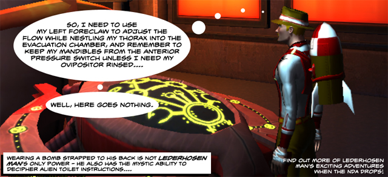
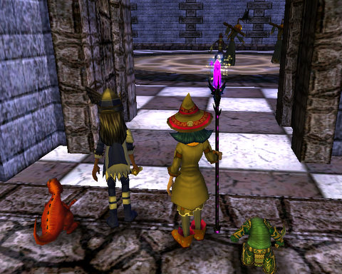

# Daily Blogroll 8/4 -- Lifetime edition

Well, would YOU bet $200 on a game that nobody but press is allowed to talk about, a month before it's released? When Lord of the Rings Online offered the same deal -- A Benjamin and his identical twin for a lifetime subscription -- you had a month to think it over. Not so with Champions Online -- [if you insist on playing before committing, the offer goes away](http://biobreak.wordpress.com/2009/08/03/champions-whats-200-to-you/). Probably the best thing about the offer -- [access to the Star Trek Online beta](http://www.champions-online.com/exclusive_specials), and Mirror Universe outfits for same. So, if I want to play STO and get all the best goodies, I have to toss two c-notes Champions' way?

They do announce STO's beta begins later this year, which is in line with their projected Spring 2010 release date.

Green Armadillo doesn't think ANY game is worth $200 to play free forever, [especially when it will have an RMT store](http://playervsdeveloper.blogspot.com/2009/08/when-is-lifetime-subscription-worth.html) that, following SOE's lead with their EQ2 and Free Realms, will entice subscribers to spend additional money each month on costumes and temporary powers. Keen feels [they should at least drop the NDA now](http://www.keenandgraev.com/?p=2779) so that the blogosphere can weigh in on Champions' good and bad points before begging players to pay blindly. Anjin of Bullet Points wonders if [the Champions IP is compelling enough](http://bulletpointsblog.blogspot.com/2009/08/news-filter-champions-online-offers.html) to take the leap of faith.

I'm in the beta, but when the NDA does drop, I won't have any glowing articles to write about it (just some comics). It's just hard to get excited about quest-based, level grind MMOs anymore. I'm just burned out on the whole idea of the grind to play mechanic. By making the level 1 game essentially identical to the level 50 game (or rather, the level 21 game, as that's as high as I've gotten), Cryptic's [previous superhero MMO](http://www.cityofheroes.com/) arguably provides a more super and less level-bound experience.

The [Evil Theurgist](http://eviltheurgists.blogspot.com/2009/08/second-offcial-meet-and-greet-somg.html) and Fallon Shadowblade of Diary of a Wizard are sponsoring their [Second Official Meet and Greet (SOMG)](http://diaryofawizard.com/main/2009/08/03/haunted-back-to-school-bash/) in Wizard 101, August 15th, Vampire Realm, Nightside. I missed the first one, but [everyone had such a great time](http://thefriendlynecromancer.blogspot.com/2009/07/meet-and-greet-wrapup.html) that I'm gonna try and make this one.

I just finished the Nightside/Sunken City arc with my (now) level 14 Myth wizard last night, too... (picture above, note Marissa's Firezilla pet!)

Gordon of We Fly Spitfires looks at EVE Online's sandbox approach to letting players determine their own goals in the game vs World of Warcraft's rails-driven approach to player achievement and wonders if it would ever be [possible to combine the two](http://blog.weflyspitfires.com/2009/08/03/freedom-without-direction-the-risk-of-sandbox-mmorpgs/) -- still have rails-driven gameplay, but with the freedom to accomplish given goals with some degrees of freedom?

I don't think that could even work. I've played both games, and they are just too far apart. Both fun, but they scratch different itches.

We haven't heard much from Ayba and Oric over in Shards of Dalaya for awhile, but news comes from the ~~gnoll-infested~~ undead-infested passageways of ~~Highpass~~ Undead Pass that our favorite halfling duo have reached level 30! Grats!

Speaking of returning from the dead, Cownose, once our connection for news of Lineage 2 and Ultima Online, is back with [dispatches from the world of Darkfall](http://cownosethe50poundcat.blogspot.com/2009/08/cow-nose-is-back.html). And is that Cameron Sorden announcing his comeback by reposting articles from the last couple of years? Aw, [no, it's not](http://www.cuppycake.org/?p=859). And, could that be some new posts by Tobold? [Yes, yes there are](http://tobolds.blogspot.com/2009/08/back-with-new-rules.html).

And lastly, Syp explains why [he's no longer excited](http://biobreak.wordpress.com/2009/08/02/mmos-off-my-radar/) about Fallen Earth, Global Agenda, Jumpgate Evolution, The Agency, APB, DCUO, and Guild Wars 2. That's mean! Doesn't [The Agency have enough problems already](http://angryrantnews.com/2009/08/02/the-agency-staff-leaves-to-start-new-company/)?

