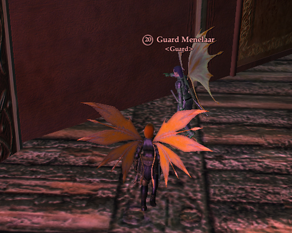
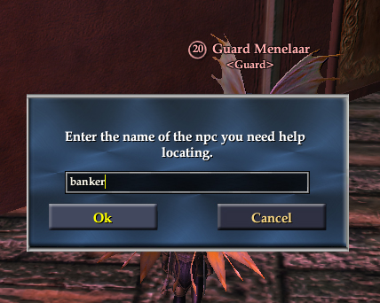
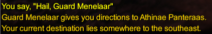
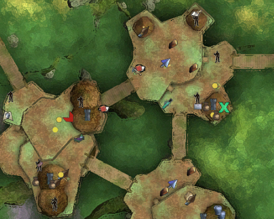

# EQ2: How to find the banker in Kelethin

Here's how to find the banker -- or any other NPC -- in Kelethin. This works for NPCs in any city. [Wolfshead was pretty positive about the Greater Faydark area in general](http://www.wolfsheadonline.com/?p=2828), and I appreciate that -- I think it's a great starting zone -- but to flatly say it's impossible to get a guard to show you to the banker unless you know the banker's name, or that it's all that hard to get around the city with the map, well....

Step 1: Find a city guard. Guards outside the city don't know where stuff is inside a city, but they can direct you around the larger zone.

Step 2: Click on them, and enter "bank" or "banker". If you know the first and/or last name of the NPC, you could enter that, too.

Step 3: Guard tells you where the NPC is generally, and gives you a glowing trail to follow to it.

Step 4: Or just look at the map.

