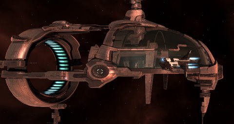

# EVE: EVEMon is a crutch.

*Posted by Tipa on 2009-08-18 06:19:41*

To mix things up while gathering enough loyalty points for a Gallente Navy Comet blueprint (so I can see if I can make copies of it and thereby enter the 30m ISK-a-pop Comet business), I moved my base from Aunia to Marsalla and offered my services to the Public Relations department of the Federation Navy, reasoning I could use relatively safe courier missions to quickly raise my LP total. 

Well, there's wrong and then there's dead wrong. The first two missions they gave were the toughest L3 missions I'd ever taken, and in the second one, I lost my prized battlecruiser, the Myrmidon "End of Innocence", and had to trash fit my new Dominix "Ignominious Defeat" to finish the mission, though too late to gather anything from "Innocence"'s wreck.

The next few missions were the courier missions I'd hoped for, but with very small LP rewards. The last was a trip into 0.0 space. I used my speedboat, the Gallente Navy Comet, slightly refit for more cargo space to carry the mission item. Being a noob, the presence of free-floating warp disruptors at the 0.0 gate to the final system was a complete surprise. These drop you out of warp within firing range of gate campers, but not within jump range of the gate. I turned tail immediately for a random planet, dropping a bookmark along the way, then immediately jumped to my new deadspace bookmark while I thought about it.

They only had two disruptors, and they seemed to be guarding the warp path to the other gate in the system, and the path to the station in the system. If I came at it from a different direction, I could probably avoid the gate camp and be out of the system before they could even see me coming. I headed to the gate from my deadspace point, avoided the MWDs and was safely out of there, mission completed, and just an easy couple of jumps from Empire space and systems with names instead of numbers.

I'd waffled a bit about replacing the Myrmidon vs just moving ahead with the battleship. EVEMon reported me months away from a decent fitting. I bought another Myrmidon (and christened it "Not This Time") and sat down to figure out how to fit it.

EVEMon had suggestions for fits, but most of EVEMon's suggestions are for people with far more skills than I currently possess. I only started EVE three months ago, I simply haven't had time to get all the necessary skills up to 5, while at the same time training for things just purely for fun (like manufacturing, mining, refining and so on, skills which aren't directly in the path of combat).

It was really clear as I pored over the fittings for the battleship and the battlecruiser that EVEMon wasn't really going to be a lot of help, and after ignoring all the numbers, colors and graphs of the fitting screen in favor of just getting a list of parts from EVEMon, buying them on the market and fitting them, I was going to have to take the time to make sense of them all.

So that's where I am at the moment. No longer relying solely on Battleclinic for my fittings, but more taking the things I loot in missions and instead of just selling or reprocessing them, seeing how they would fit in my ships. I'll be able to use Battleclinic again in a couple of months, but while I train up my skills, I'll be learning how to fit my ships on my own, and really, it's about time.

