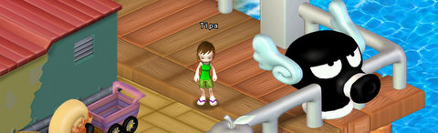

# Daily Blogroll 9/1 - Hell, O Kiddie edition

*Posted by Tipa on 2009-09-01 07:48:27*

(Shhh! Hello Kitty Online's closed beta started yesterday! Expect a HKO First Look once I've found my way around).

Massively reports that [EVE Online's next expansion, Dominion](http://www.massively.com/2009/08/31/eve-online-announces-dominion-expansion-walking-in-stations-r/), has just been announced. Dominion brings a new focus on planets, undoubtedly setting the scene for EVE's planetbound companion FPS MMO, Dust 514. EVE is also adding social media functionality to the game, and I have no idea what that means. Tweet every mission? No clue. Lastly, the walking around in stations expansion is given a name, Incarna, so I guess we're stuck in our pods for at least another few months.

In the "But, I Want To Play A New Game Right Now!" department, Syp brings news that [Dungeons and Dragons Online's F2P mode is live](http://biobreak.wordpress.com/2009/08/31/theres-this-dungeon-see-and-a-dragon/), so, like, log in and kill stuff. I played D&D, the pen and paper game. We never had to grind dungeons to level. Sure, it would be [impossible for Turbine to make new content every month](http://www.ghetto-overlord.com/Blog/?p=61), but the thing about an adventure is that you only go on a certain adventure once, right? Like, once you've spent the entire movie training to blow up the Death Star and then it goes boom, at least you don't have to worry about [doing the whole thing all over again](http://en.wikipedia.org/wiki/Star_Wars_Episode_VI:_Return_of_the_Jedi).

Should children be raiding in WoW? Beau [loses his cool](http://epicdolls.com/beauturkey/?p=2062) over a podcast that gives advice on getting your 11-year old into raiding. I'm right there with him. Children should not be playing games that [suck all your time](http://www.csd.uwo.ca/Infocom/dungeon.html) when they should be out living their lives. Looking back on my own time, as an adult, sucked into full time raiding, those years are GONE. I would NEVER wish that on a child. Letting your young child spend hours each night playing WoW or any other timesucking game is a kind of child neglect. Do you really want your kid growing up, learning how to interact with people via what you hear over voice chat while raiding?

Syncaine's staggered by the (apparent) [mad rush of bloggers to return to WoW](http://syncaine.wordpress.com/2009/08/31/maybe-its-time-to-return-to-wow/) following the announcement of next year's Cataclysm expansion. 

> ... Is EVERYONE from the blog world back in WoW right now? Failbears all of you! (Like carebears, but when carebears go back to WoW they become failbears) So a month of nothing but “so I did this daily just to grind this rep/token/whatever, it was cool” reading huh? Awesome. To counter this I’m going to start reporting on all the iron nodes I hit in DarkFall (which according to my fiancé is all I do in that game), but each node around Hammerdale I’m going to give a different name, and then phrase them like this “Monday, I went out and complete the Northern Bob daily, just to work on my ‘smithing’ rep with the ‘character’ faction. I love the Northern Bob daily because while it’s both north and called bob, it gives nice rewards and I don’t have to commit hours to get something done”. God I’m bored just writing that…

I'm kinda of two minds about what I call "gameplay" blogs, where someone just posts what they did that day. If I play the game, they're interesting, and if I don't, I skip 'em. Remember, like malaria and syphilis, you never entirely get over World of Warcraft. So I'll auto repeat the page down key on a month's worth of "I did something in WoW today!" posts because I know those bloggers will come back with cool stuff in the future.

There's a reason, after all, that I don't often post about what I did in EVE today ;)

The infosphere was abuzz with yesterday's news that [Imperial Disney had annexed Marvel comics](http://thallians.blogspot.com/2009/08/disney-is-buying-marvel-its-official.html). So I guess we'll be seeing trailers for Disney's Princess Collection ahead of Wolverine 2? Seriously, when I think of Disney together with [Gazillion's in-development "Avenger Babies" MMO](http://marvel.com/news/vgstories.7249.Marvel_MMO_Deal_Signed), just one word comes to mind. ~~Disaster.~~ Synergy.

Information about EQ2's upcoming "Shard of Lurrrrve" update continues to seep from the test server. Ogrebears has a quick, thumbnail overview of [the different kinds of achievements](http://ogrebear.com/?p=1289) you'll be linking to prospective group leaders in the near future, while Stargrace takes a look at [the "chronomagic" auto-mentoring system](http://mmoquests.com/2009/08/31/gu-53-part-ii-chronomagic/). 

Re: WoW achievements, and I ask because I don't know. Are the group leaders who are insisting they be sent stats and achievement links before they will let someone in the group, ever required to link their own stats and achievements? EQ2 is deep into the "Must have T2 and Mythical" territory already. Achievements are just gonna make EQ2's community even more like WoW's.

Warhammermer has all the good news on [Free Realms' daily slot machine lotto game](http://exploringwar.wordpress.com/2009/08/31/free-realms-spin-the-wheel/). Spin the wheel, get a prize, step right up. I have no idea how that game is doing. I really liked it, but I have a career MMOer's short attention span.

The Friendly Necromancer reminds us that tomorrow is the first anniversary of the launch of 2008's most original new MMO, Wizard 101. [And he even baked a cake](http://thefriendlynecromancer.blogspot.com/2009/09/happy-birthday-wizard101.html)! There's MMOs out there, a LOT of MMOs, that I regret losing hours of my life playing. Wizard 101 is NOT one of those. I have enjoyed every moment in the game, and I still play it daily, leveling a new duo through the worlds (currently in Hyde Park, Marleybone). So, happy birthday, Wizard 101, and thanks, KingsIsle!

