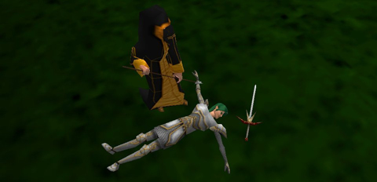
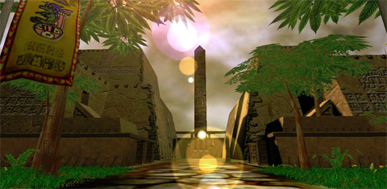
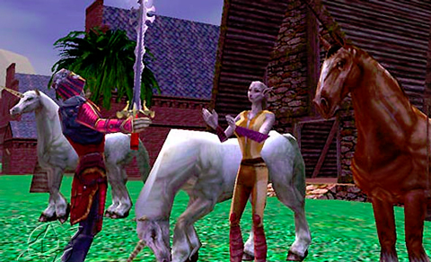
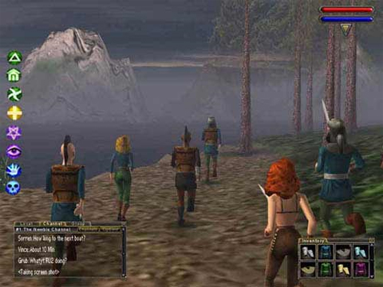
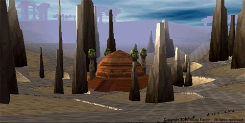
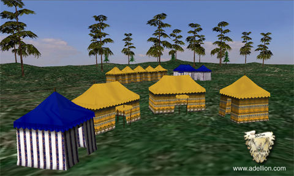
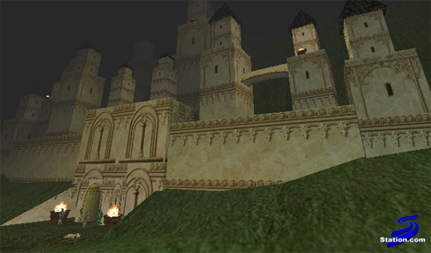

# Daily Blogroll Looks Back: 2001

*Posted by Tipa on 2009-09-13 21:29:49*

I was cleaning out my closet and found a few old floppy disks, REALLY old. Someone had scrawled "Daily Blogroll: Sep '01" on them. I honestly don't remember writing any blogs way back then. I had no idea what was on them. They were two 8" disks, so between the two of them, there could be as many as four or five pages of documents sitting there, unread, for eight years.

It was a wide, wonderful, weird world back then. The success of EverQuest, Asheron's Call, Ultima Online and Dark Age of Camelot had changed the landscape of online adventure gaming. By requiring players to have hardware 3D graphics acceleration in their machines, EverQuest raised the bar for all MMOs that followed.

It's not easy to track down an 8" floppy drive these days, but after some calls, I was able to find someone who could read these disks for me, and he sent me a digital copy of the contents. So sit back, grab a snifter of absinthe, put on your bustles and top hats and travel with me back to a time when unicorns grazed the bowling fields and MMORPGs were young.

---

If you're having trouble releasing ONE MMORPG, why not start another? And if that isn't working out for you, how but just one more? Glitchless, developers of groundbreaking, never-before-seen, you are not WORTHY of playing MMORPG Dawn, who earlier this year suspended development on Dawn to work on a new RTS set in the same world, Dusk: Dawn Tactics, has today announced that they are pushing all those aside and [coming out with an even BETTER game](http://web.archive.org/web/20010923092156/http://glitchless.com/), Racewar Kingdoms. Quoth GM Jeff:

> Race War Kingdoms has been completely re-made and is now an entirely different title complete with graphics, and real-time gameplay! A public beta is being held for 3 days, get in before it's too late!

Complete with graphics! Don't miss it! Race War Kingdoms, you may remember, was originally a web page where the more you clicked, the more you won. Now it has GRAPHICS!

It wouldn't be a Glitchless game unless it featured permadeath. As GM Jeff said in [a Stratics debate last January](http://web.archive.org/web/20011102141956/http://www.stratics.com/content/devdebates/devdebates/012701.shtml), permadeath is a way to ensure that the people who aren't SERIOUS about roleplaying quit the game, so everyone wins:

> *GL-Jeff* Well the anti-perm death crowd has already stated that permdeath would "shorten" the lifespan of the PERSISTANT world. I believe they are already admitting that yes, the players that are not serious about playing for RP purposes will leave the game early. 

Well, in reality, groups of PKs would just band up and completely ruin the game for everyone else at no risk to themselves. Jeff has apparently never played Ultima Online. Didn't we just have this debate with Sierra's [Middle-Earth Online](http://web.archive.org/web/20011029172307/http://haven.theonering.net/gaming/middleearth.html)? It's just weird seeing people seriously argue that EverQuest's death penalty is not severe enough.

Rumor has it, btw, that the EverQuest devs are considering upping the three hours before your corpse and all your possessions decay to something a little longer. About time.

You know what modern games really need? More lens flare. Seriously.

What's that game where you can play a dragon, pick up a player in your claws, fly a few thousand feet up, and release? Oh yeah, Horizons. But heck, why stop there? Why not terrorize player-built villages by strafing them with your fire breath? In Horizons, you can be a Vampire (but as long as you kill only players nobody will miss, nobody needs to know). Or a demon, or an angel, an insect, a lizard... 14 races, most never seen before, embroiled in a complex, shifting web of loyalties and all-out blood war.

At least [they're staying mum on the whole permadeath debate](http://web.archive.org/web/20010815063123/http://www.artifact-entertainment.com/horizons/faq-general.shtml#d2)... 

Artifact Entertainment, makers of Horizons: Empires of Istaria, recently signed a publishing agreement with Korean developers NCsoft. They must have been a little shocked when ex-Ultima guru Lord "Richard Garriott" British grabbed the spotlight away from the Horizons team with news that his Destination Games would merge with NCsoft's US arm [to become NCsoft Austin](http://www.mobygames.com/developer/sheet/view/developerId,483/) and develop their own new MMO.

[Quoth Artifact CEO David Allen](http://web.archive.org/web/20010808161601/www.horizonsfansite.com/DA.shtml) when asked how Horizons and Garriott's new MMO would compete with each other: *"At this point, not at all - Jake and Richard are developing something completely new and innovative; I don't think they're even going the traditional RPG route. We'll have to wait and see!"*

Meanwhile, back at ~~the ranch~~ Origin Systems.... Ultima Online Worlds, 3D follow-up to the spectacularly successful (but non-3D) MMO Ultima Online, has been canceled. Asked why this title, which would have taken the Ultima MMO franchise for the first time into the 3D arena, was canceled, Origin's David Swofford said [the decision was made to focus on Ultima Online](http://pc.ign.com/articles/092/092636p1.html) and try to reclaim the #1 spot among persistent world games from such Johnny-come-latelies as EverQuest and Asheron's Call:

> ... We're trying to get our numbers up higher than they are. We're already up to about 230,000 subscribers and UO has grown about 80% in the past year. I think that's one of the reasons that EA and Origin are saying, "Hey, why toy with success?" Rather than going forth with something that could be construed as a competitive product we're going to put more of our resources on UO and make it even more of a success. 

Well, they definitely don't want to come out with a competitive product....

Information about sports game impresarios Codemasters' new MMO, [Dragon Empires](http://web.archive.org/web/20011116215637/http://www.codemasters.com/dragonempires/), due out near the middle of next year, continues to trickle out. This groundbreaking game has player guilds warring against one another for control of the cities and resources of the world. According to the press release:

> Due in 2002, Dragon Empires is set when magic is plentiful and the lives of humans and dragons intertwined. The game innovates by creating a world of adventures that will be filled with player clans, each striving to rule magnificent cities and, ultimately, empires through tactical dealing or clan-on-clan combat.

[You won't be able to *play* a dragon](http://web.archive.org/web/20011116220809/http://www.codemasters.com/dragonempires/faqs_web.htm), though....

If your tastes run more toward building and crafting than all that messy war everywhere stuff, Atriarch might be more your style. Players will be able to build any structure they can imagine, LEGO-style. Tired of playing elves, dwarves, and elves? Atriarch does away with all that by setting their game on an entirely alien world. And unlike Dawn's strictly sexual reproduction, Atriarch is a little more "don't ask, don't tell" about it. [Atriarch lead designer Serafina Pechan says](http://web.archive.org/web/20010123211300/www.zdnet.com/gamespot/stories/features/0,12059,2657266-3,00.html):

> Atriarch supports the ability for player characters to have families. We call it the Lineage System. Every player can have its character spawn offspring through asexual reproduction. There are two ways your character's family and lineage can expand.

It's always been my fervent, till now unspoken desire to propagate like a bacteria.

News about the game has slowed down a bit recently, but alpha testing is expected to begin soon, and if you'd like to get in on the ground floor, [bribery might help](http://web.archive.org/web/20001214091200/atriarch.com/features-faq/FAQ/faq.html)...

> Of course, if you truly want to ensure your spot as an early Atriarch tester, then bribes in the form of EQ platinum will be accepted on the Povar server. Other suggestions for offerings, donations, or outright bribes can be emailed to: pleeeeeezepickme@atriarch.com ;-)

If war everywhere is what you're after, Adellion has the stuff. Massive battles. Permadeath. No magic. No elves, dwarves, or any race but human. A world so large that you couldn't cross it if you set your character dashing across it on horseback for an entire day. Adellion's [recently released FAQ](http://web.archive.org/web/20010502123813/www.adellionworld.co.uk/faq.htm) explains all this and a little more about what it means to play in a game where role-playing is *enforced*:

> If you're not a role-player in fact, you need not apply. Why? Because everything-and we mean everything-in Adellion will be done In Character. If you log onto the game with "Yo-wazzzuuuuppp?" you will be greeted with "Huh?" … 

Gotta love a game that spells out why they don't want you as a player in their FAQ.

EverQuest's latest experiment, the "anything goes" PvP server Sullon Zek, is now continually posting PvP stats on the aptly named [Sullon Zek PvP stats page](http://web.archive.org/web/20010726112027/everquest.station.sony.com/stats/sz_summary.jsp). As if you needed ANOTHER reason to hate Halfling Druids...

Meanwhile, the game awaits next month's new expansion, Shadows of Luclin, which will bring an all-new graphics engine, all-new character models, a moon landing [which devs assure us won't be faked](http://www.apfn.org/apfn/moon.htm), and ... hey, if there's this moon called "Luclin", how come nobody's ever seen it before? Huh???

Anyway, EQ might be revamping all its graphics, but it ain't no Adellion, that's for sure.

Well, the floppies are getting full so I guess that means its wrap-up time. MMO gaming has never been better, with the huge success of EverQuest, Ultima Online and others spurring the development of dozens of huge worlds full of adventure. 2002 is shaping up to be the best year ever for the MMO genre.

