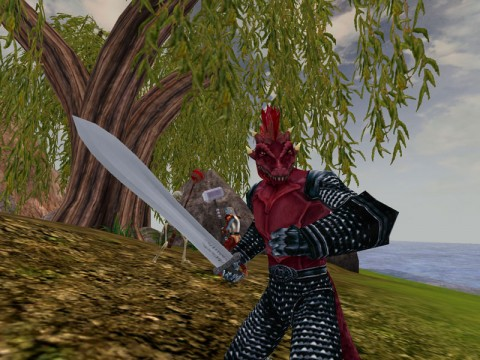
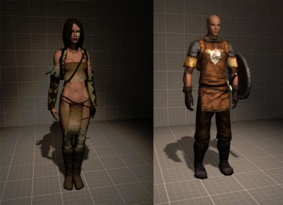

# Daily Blogroll Looks Back: 2001 -- Followup

Yesterday I blogged about several games in development in 2001 that maybe aren't so well known these days. Back in 2001, nobody knew Blizzard's World of Warcraft would change the scene, but everyone knew great things were ahead. Computers were doubling in power every year, graphics as well, and what looked good in 1999 looked downright primitive just two years later -- EverQuest's graphics overhaul that began with Shadows of Luclin and continues today was testament to that, as well as the new beginning of EverQuest II.

What would the world be like if EQ had presciently followed WoW's lead and completely rewrote their existing world, Cataclysm-esque?

Today I'd like to look at what came of those games.

**Dawn by Glitchless Software**

The bar was so low and gamers so excited that all you needed to become the CEO of a world-class MMORPG development firm was a website, a copy of 3DStudio and a FAQ that explained in delicious detail how your game was going to be the next big thing and just blow some "unnamed game" (EverQuest shhhhh) away by fixing all its problems and adding a laundry list of every feature anyone had wanted EVER. Stratics and IGN were all too happy to legitimatize every announcement with forums, dev chats and endless speculation that went places even the most wild-eyed developer wouldn't dare go.

Nowadays, people typically insist on seeing the game in some form at a GDC conference. Unbelievers, all.

Jeff Friedman, at that time an 8th grader (we assume by his offhand mention of a test in pre-algebra), with a copy of Visual BASIC and a top secret "MMORPG API" that would propel MMO development to heights unseen, announced Dawn, a groundbreaking MMO already nearing alpha test. Jeff's inability to say "no" to any potential feature led to lines of questioning about Dawn's sexual reproduction system for all monsters -- and PCs. So, female characters can get pregnant? Yes. And they have to carry the baby to term? Um, yes. And can they miscarry? Yes! And can that miscarried fetus be picked up? Yes! And loaded into a catapult? Yes!

Thus the [fetapult](http://wiki.onlinegamers.org/index.php?title=Fetapult) was born, which may end up being Dawn's only legacy.

By early 2001, development on Dawn had already shifted to development what was once promised to be Dawn's sequel, Dusk. Dusk, now renamed Dusk: Dawn Tactics, was to be a RTS game (all the rage at the time) built on the 3D renderings Jeff had already down for Dawn.

Amidst yells of potential players for the Dawn alpha (always imminent) or some news of Dusk, Jeff came out with a simple browser game which simply had you pick an opponent and press the fight button -- [Racewar Kingdoms](http://www.racewarkingdoms.com/index.html). This morphed into a more traditional land conquest browser game which seems to have been updated as recently as 2007, though the prize computer advertised on its login page is so, SO far out of date (Pentium 4?) that I suspect it hasn't seen much love in at least four years.

Glitchless' latest project is a browser-based game called [Nodiatis](http://www.nodiatis.com/), a multiplayer RPG that takes most of its cues from RPGs of 25 years ago such as Bard's Tale and Ultima III. Nodiatis development started in 2002 and was released a year ago June, and while it might not ever live up to Dawn's promise (or even try), it's not bad for what it is and seems fairly popular.

**Horizons: Empires of Istaria by Artifact Entertainment**

Now renamed "[Istaria: Chronicles of the Gifted](http://www.istaria.com/)" and run by Virtrium LLC, Horizons's ambitious FAQ was backed up by a 50 person development team. Where Glitchless' Dawn pronouncements were met with ever-increasing skepticism, Horizons looked like a game we might someday actually play.

And what a game. Where other games were peopled by humans, or humans with slight differences in coloring or proportions, Horizons would offer angels, demons, vampires, merfolk, fairies and on and on -- and dragons! PC dragons, complete with flight, fiery breath, treasure hoards and an insatiable hunger for cattle. The world of Istaria would be awash with war, but the efforts of players could keep that war far away from civilization or right in its midst. In Horizons, the actions of the players would make each server a unique, individual world.

Plagued by cost overruns, Horizons development was scaled back and the schedule pushed out. Horizons was [released in late 2003](http://www.gamespot.com/news/6085125.html) to [indifferent reviews](http://www.gamespot.com/pc/rpg/horizons/review.html?om_act=convert&om_clk=gssummary&tag=summary;read-review).

Horizons lead developer David Bowman formed Tulga Games in 2005 and took over development and operation of Horizons even as he started development on a new MMO, Human/Vampire/Werewolf-themed Dark World Online. In 2006, he ceased development on both games and sold the rights to EI Interactive, who sold the rights to the now-named Istaria to Virtrium LLC, who continues development and operation to the present. Istaria has just released a new, massive content update and is now to be known as Istaria: Dralnok's Doom.

Horizons six years later is a niche game with a small but devoted following, but unlike most of the games on the list, it saw its way through a book full of problems to release.

**Adellion by HonourBound**

Primitive though the world of [Adellion](http://adellion.com) may be, it's nice to know that they have discovered bikini wax.

Originally started in 1999 by a group of English developers, [Adellion's progress](http://www.adellion.com/TechUpdate5.php) seemed married to its experience in developing for the popular [Torque game engine](http://www.garagegames.com/). Originally intended to be a realistic world of adventure with limitless landscapes and all the brutality of real warfare, it clearly has become the pet project of a group of part-time developers.

Time and the Torque engine have seen Adellion backpedal on its initial promise of a world so large that you couldn't cross it on horseback in an entire real-world day.

> ... Due to limitations in the game engine, [the team decided recently to reduce the size of the world](http://web.archive.org/web/20031030142538/http://www.mmorpgdot.com/index.php?hsaction=10053&ID=768), an unexpected boon to game play as recent play tests have shown that the last thing gamers want to do is spend hours running from location to location.

Maybe they'll also realize that players don't want to lose their invaluable time when their character is taken away from them forever the first time they die. Though to be honest, I haven't seen anything recent from Adellion that implies they still think permadeath is a selling point.

I doubt we'll ever see an Adellion MMO on the market, but hey, why does it always have to be an MMO? If Honourbound hasn't the resources to bring a modern, fully-featured MMO to market -- and it's clear they don't -- then why not make some other kind of game? Adellion was started at a time when it seemed all you had to do was announce a game, and thousands of eager players would line up for the chance to provide the content for you by doing interesting things in lieu of actual direction from the developers. A theme common to pretty much ALL the games of the early-naughts was to give players an open world and let them make it live.

Since World of Warcraft, sandbox MMOs have more or less vanished in favor of quest-based games that lead players on a well-trodden path from character creation to the repetitious pleasures of end game content.

Make a really good single player game, and then if you still feel the need, use that as the basis for an MMO some time in the future. That's what the [Torchlight](http://www.torchlightgame.com/) folks are planning, and its a plan the Adellion devs would be wise to follow if they ever expect to see their decade of work come to store shelves.

