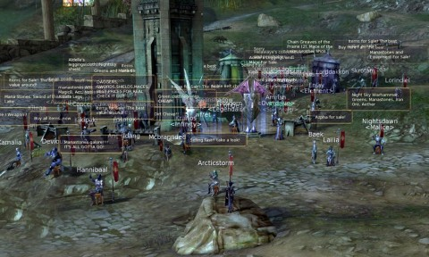
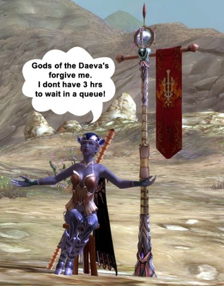

# Aion - Living the Dream in the Ghetto

*Posted by Saylah on 2009-09-22 19:19:15*

*Can't stop Saylah from blogging :) - Tipa*

---

Leave it to the creative player-base to find a way around the 3-hour queues on the high population servers. Some have decided to stretch the “Personal Shop” feature that allows you to sell items while unattended, into a means of keeping their characters online 24x7. I mean – seriously, all I could do was laugh my ass off when I logged into the game and saw the sea of players who are mostly just AFK, setup as vendors. I felt like I was in the market district of some turn of the century ghetto. Mind you, somewhere in that mass of “For Sale” slogans and messages are quest NPCs and people that really have things to sell. Can anyone say, “Where’s Waldo?”

I can’t complain or blame them really. If you’re on a server in this situation but don’t want to leave your friends or legion behind, I suppose it’s every gamer for herself. Supposedly NCSoft is going to limit the duration of the inactivity of being in the “Personal Shop” mode to 24 hours, after that if you’re AFK you’ll be disconnected. If I had the time I’d check into how these shops play out in Korea. They are rather painful on the eyes even when people aren’t using them for queue avoidance. I like the idea of the shops but a few features like the ability for me to turn off seeing the signs/messages would be a good improvement. I’d also suggest that the AFK-timeout on them be somewhere between 2 to 4 hours, versus 24 hours.

And no, you can’t just tell people to leave high pop servers if they don’t want queues. Server and race access is very touch and go – minute to minute, making it impossible to migrate as a group. Our legion is now in limbo with some members sitting on the high population server progressing characters. While others reverted to the secondary choice so they could at least start playing. When we tried joining them on the secondary server, which was at least low population last night with no queues, we found that while low population, the server wasn’t accepting more players for our faction. Goodness grief. 

I only have this week to play much Aion. In a couple of weeks I’ll be away on business for 12 days and then starting the next writing workshop. It’s a tad bit annoying having to deal with this in my window of availability. I’ve decided to be a bad girl. I’ve succumb to using the unattended vendor trick to log into the game late in the afternoon, so that I can actually play when I get off work. It’s a comically sad situation but when in Rome…

