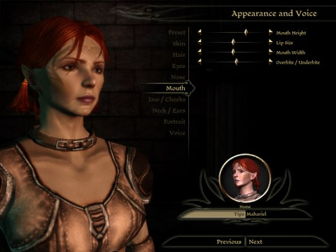

# Dragon Age: Origins

After reading Pete of [Dragonchasers](http://dragonchasers.com/) go on and on about the wonderfulness of Dragon Age: Origins, I couldn't let pass the opportunity to make my own character in [the recently-released character creator](http://dragonchasers.com/2009/10/13/dragon-age-character-creator-released-and-a-word-about-gameplay/) and get some sort of feel for the game.

The character creator not only asks you to define the look of your character and the class, but also your story. Yup, this is a Bioware game. You don't enter the world without a history. Perhaps you come from a high family and your brother is already at war, commanding the armies of the South. Or a street grub who stumbles on an opportunity for greatness. Or a mage who soon must take the test of Harrowing to determine if they are a danger that must be destroyed, or someone who can control their power and use it for good.

Though Dragon Age is not based on the standard Dungeons and Dragons license, the blood apple doesn't fall too far from the pain tree here. The six stats will be instantly familiar to anyone who has played a similar game.

The character creator teases with pages of abilities you can't have yet. My standard rogue can go the way of a stealthy assassin, a back-alley brawler or a forest warrior by taking various paths through the skill tree. Like other Bioware RPGs, you'll eventually gather a party of NPCs who will be able to fill any needs you don't bring to the table, so I imagine it's likely hard to gimp yourself too badly from the start.

Dragon Age competes directly with Runic Games' Torchlight, also coming out this fall. But with Dragon Age's focus on an epic story and Torchlight's emphasis on quick action and extensive modding support, dedicated fans of the tradition single player RPG will probably find themselves playing both.

