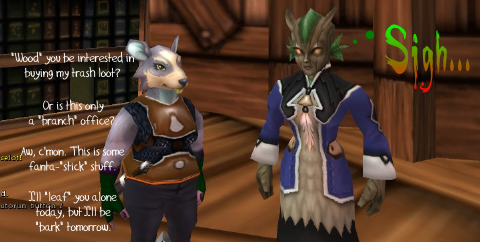

# Daily Blogroll 10/14 - Puns R Us edition

Earth Eternal's Sylvan have to put up with this every day....

First off, responding to parental concerns that their children would be gambling away their RMT currency for minimal rewards, KingsIsle has announced that [the "wishing well" cash slot machine will NOT be making it out of test](http://diaryofawizard.com/main/2009/10/13/wizard101-the-wishing-well-will-not-be-going-live/). Thanks to Fallon of Diary of a Wizard for the scoop!

Kaozz of EC Tunnel has compiled a list of a lot of Octember All Hallow's Eve events for all the major MMOs -- including Maple Story, big props for including even the MMOs that are way more popular than WoW -- so there's [your to-do list for fall fun](http://ectunnel.wordpress.com/2009/10/13/fun-events-in-october/).

Gordon of We Fly Spitfires is so excited by [Quake Live](http://www.quakelive.com/) that he wonders -- [why can't "EverQuest Next" be more like "Quake Live"](http://blog.weflyspitfires.com/2009/10/13/everquest-in-your-browser/) -- fully in the browser, zero downloading, etc? And also, more pewpewpew... 

Well, maybe, but if you read between the lines, it's almost certain that EverQuest Next will be a PS3/PSP release. A browser-based EQ would compete with Free Realms, and they've learned the lesson about [competing with themselves](http://eq2players.com)....

Dalayan Diary's Ramon writes about using [the Shards of Dalaya web-based item marketplace](http://dalayan.wordpress.com/2009/10/13/oric-is-happy-about-new-weapons/) to buy some new swords for his happy haffer. Web-based marketplace? Yes, please! Talk about bringing some pretty meaty gameplay to the web.

[Scopique has an epiphany](http://www.cedarstreet.net/2009/10/i-want-to-be-done-with-this.html) and realizes that most recent high-profile MMO releases are essentially identical. I commented on his post and will repeat it here -- DON'T support MMO clones. If you want WoW's gameplay, PLAY WOW. If you want something different, PLAY A GAME THAT DOES SOMETHING DIFFERENT.

Is fighting other players too scary? That's okay, [Darkfall is adding boars](http://syncaine.wordpress.com/2009/10/13/mmo-fluff-what-is-it/), wolves, bears, lynxes and annoying little birds that follow you around adding into fights and just wasting your time to make quest grinding even more tedious. Oops, sorry. LotRO flashback.

Budding stalkerazzi have a friend in Luna Online -- now you can choose from a list of matches randomly chosen by the game based on your player profile and go to [a special, two-person instance for the purposes of LURV](http://exploringwar.wordpress.com/2009/10/13/luna-online-whats-a-dating-dungeon/). And you can have some hot coffee afterward!

And finally, Syp really, really [wants you to stay away from hit-indie MMO, Fallen Earth](http://biobreak.wordpress.com/2009/10/13/why-you-shouldnt-play-fallen-earth/). Seriously. Your 80 Night Elf Hunter misses you. Nothing in Fallen Earth for you.

