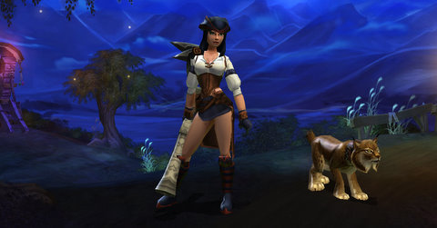
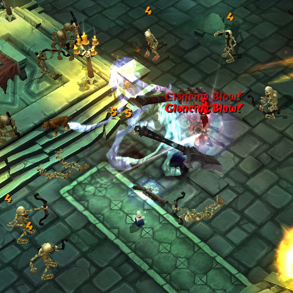

# Torchlight: Just call me a Huntard....

*Posted by Tipa on 2009-10-28 06:04:23*

Oh, let's [call a spade a bloody shovel](http://en.wikipedia.org/wiki/To_call_a_spade_a_spade), shall we? Attack from a safe distance with a rifle? CHECK. Kitty pet that does all the hard work (including *running to town to sell loot*!!??) CHECK. Yeah. My Torchlight character is a hunter, no two ways about it. But in old Mythos fashion, she could have gone down other paths than Marksman -- she could have chosen to become a Rogue, a master of thrown weapons and two-bladed fighting, or an Arbiter, expert with traps and gadgets.

Similar to the much-missed Mythos, choosing between the three classes (Vanquisher, Destroyer (warrior) and Alchemist (mage) doesn't lock you in to a specific style of play. All three have elements of the other classes available.

Alchemists, for example, can specialize in Battle, which gives some weapon skills, Lore, which summons pets to fight for you, or Arcane, which grants the more traditional mage powers. Destroyers similarly can spend points in Berserker, the melee path, Titan, the ranged/nuke path, or Spectral, the pet-summoning path.

That's 3x3 or 9 separate paths, and you can spend points freely among the paths as you level. This is more choice than you're given in character creation, where your choices are limited to picking your class, the name and species of your pet, and the difficulty level of the game. While such little choice was understandable a dozen years ago when characters were just tiny, 2D pieces of animated pixel art, it's not 1995 any more.

I don't have time to write more about Torchlight right now, but expect to hear more later as I delve deeper into the Ember mines below the beleaguered city. Right now, Torchlight is just enough like Mythos to make me miss what could have been the best MMO of 2008, more than I already do.

