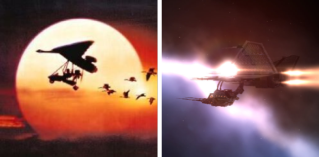

# EVE Online: Dealing with the Caldari problem

*Posted by Tipa on 2009-11-03 07:40:24*

As much as I like picking up Caldari and Amarr dogtags from my kills and selling them for lots of ISK to pilots who pretend loyalty to those violent races, it's getting to the point where I can hardly warp into Amarr or Caldari space without warnings to move off or be shot down. Since I do like running trade routes into Caldari-owned Jita for spare change, this could become a problem. Only my training in Diplomacy lets me dock at 4-4.

I thought I would humble myself and see if perhaps I could run some missions for these lesser folk, take the first step toward a new understanding between the upright Gallente Republic and the unwashed barbarian hordes. I flew to Caldari space hoping to enroll in their schools for new pilots, but when they asked me to talk a little about myself in the application and I wrote "my ship is stained green with the blood of Caldari pilots", they politely escorted me out of the station at gunpoint.

Barbarians, I tell you.

Turned out I went to the WRONG SCHOOL, but I was feeling kinda down, so I set the navigator for Minmatar space and started plotting out the next chapter in my thrilling holonovel, "Better Than You: A Gallente Story".

The Minmatar's were only too happy to see me. They'd had a lot of dealings with OtakuCorp, and were willing to start me right off on Level 2 missions. I smiled and asked for the tutorial missions. I was hoping to fly through all three arcs and do the epic arc for standings, and then try my luck with the Caldari again.

I'd flown my Gallente Navy Comet because, GALLENTE REPRESENT, right? The instructors smiled and gave me a Slasher instead.

Now, I don't mean to dis my Minmatar brothers and sisters, but the last time I saw a craft of THIS design, it was leading a flock of Canadian geese to Maryland in the indie kid's movie, Fly Away Home.

So while I wait for my business skills to finish training, I guess you'll find me honking at the head of a flock of ~~geese~~ drones or something as I go on a desperate quest to make everyone LIKE me, if I have to kill them all to do it. 
