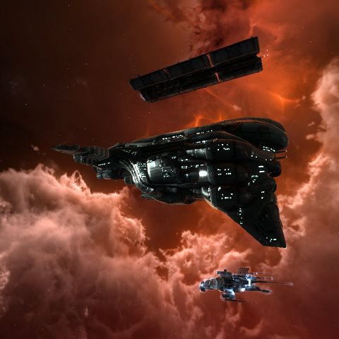
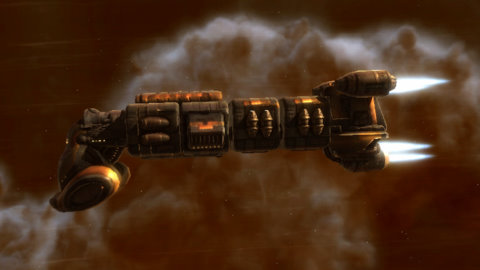

# EVE Online: How to get shredded in W-Space

*Posted by Tipa on 2009-11-12 08:05:18*

Since we started flying Wednesday Ops Nights with Holowan Industrials, the phrase "usually, it goes better than this" has become as legendary as "I have a bad feeling about this" and "at least it's not raining".

(I was riding my bike home from work a couple of weeks ago and it was raining so heavily I could barely see, and the gusty winds seemed to be against me the entire way. I couldn't help thinking, "well, at least it isn't SNOWING.")

HWN had scanned down a wormhole in nullsec, Providence space, and thought it might be fun to head through it with a few ships and do some very lucrative mining -- the rarest and most valuable minerals in the galaxy are on the other side of nullsec wormholes. I was still in Simela with my Myrmidon mission ship, working on my Sisters of EVE standings, and was about to head down to Providence when I thought to myself "hmmm.... how much do I want to lose my mission ship?"

I decided to stop by my home base in Aunia and swap it out for my Brutix -- just in case things got a little weird in there. Even though -- what could possibly go wrong, right? The fleet leader estimated our chances at encountering PvP at approximately zero, and really -- how dangerous could mining get? Bring some miners, stuff everything in an Orca, fly home with holds laden with expensive ores.

So we got in there in good order. At least ten pilots and an Orca containing more ships if needed. The system scanners got to work and -- no asteroid belts, anywhere. Had they already been mined out? Probably -- this wormhole was in a pretty high traffic part of Providence, after all, and there was at least one player owned station in the system.

Plenty of complexes, though. Over thirty of them. A scout checked it out in a covert ops frigate, cloaked. Some heavy drones, some sentry towers, should be okay.

Stuff always looks okay when you're cloaked.

A couple of our battleships warp in followed by the rest of us in smaller ships. BOOM. Half a dozen beams stab out from 100km away, and the drones wake up and come flying out. They don't do much damage. They just web and scramble ships so they can't get away from the beams. Most of us make it back to the safe spot alive.

After that, we try to keep the beams distracted while a bomber attempts to pick off the sentry towers from extreme range. Since my Brutix was made for running down smaller ships and tearing them apart, I started taking out the heavy drones. Aggro shifted the way aggro does with Sleepers, and suddenly the drones noticed me and wanted to have a discussion about what I was doing. They called their friends the death beams over to join the discussion and then I was sitting in my pod, staring at the wreckage of my Brutix, "Pound Foolish".

I left W-space and found another player at the other side of the wormhole, who had a snarky remark, when he saw me in my pod, on how well things were going in there.

Whatever.

I bought a cargo frigate from a station one jump away and came back to see if I could get my stuff. Fleet chat was making that seem all too possible; the sentry beams were out, and all but one of the drones was dead. As I warped through the wormhole, the last drone died, and the second wave spawned. Four battleships, ten times the strength of normal battleships.

I warped in 100km from my wreck -- no notice from the battleships. I warped in right on top of it -- no notice. I started looting my old wreck, and then the battleships noticed me. They were 112km away (why do I remember that?), but they locked on and killed me in two seconds, and I was once again in my pod, looking at wreckage.

I wrote off the loss (though thanks to Kzaara who tried to get my stuff and got disassembled for his trouble) and headed back to base.

Red, who was first to lose his ship, had been predicting the events like some sort of space-born [Cassandra](http://en.wikipedia.org/wiki/Cassandra). "This is a level 5 wormhole. Where 6 is the worst. Battleships are a minimum for this," he warned. "If you kill the last drone, the second wave will spawn," he warned. And like legendary Cassandra before him, though he prophesied truly, nobody believed him.

It was a fair flight back to Aunia in my pod, and I debated whether I should even bother replacing the Brutix. It's a nice ship, but entirely devoted to being a melee-range scrapper like some sort of overgrown frigate that would look about as appropriate as [a middle-aged man on a Little League team](http://www.imdb.com/title/tt0437863/). Nonetheless, it's a nice ship.

Sure, I could BUY one, but I checked out the price of the blueprint copies on the Contracts market and hey, 2.5mill for a 10 run blueprint? And the list of materials were all common minerals. I could build ten of them, save one for myself, sell the other nine, and make a good pile of money on the side. I headed for Jita in my Comet to pick up the blueprint.

When I got to Jita, I browsed the market some and holy WOW, Viators were cheap! Normally I see them for anywhere from 70mill to 80mill and up, and I could pick one up in Jita for just 57mill! So that was 13mill cheaper than the best price I'd seen anywhere until then. My alt had just finished the training necessary to fly it. I just had to have it.

Viators, by the way, are tech 2 "blockade runner" transport ships. Fully fitted, they are almost impossible to capture when flown by a skilled pilot. Interdictors are the only ships that pose them any danger, and they have to be on the ball to even have a chance. For freight haulers who want to do business in the deadliest parts of space, there's no other choice. You HAVE to have one.

Flying a Viator is a little nerve-wracking. It's my first tech 2 ship, and I haven't trained up cloaking yet, so it's a curiosity. You're not supposed to ever SEE Viators; that's their power. Flying home just before server restart, gates crowded with last minute travelers, I felt like a target.

It's safely in the hangar now, but stay tuned for stories of how I lose it doing my first nullsec courier contract :P

