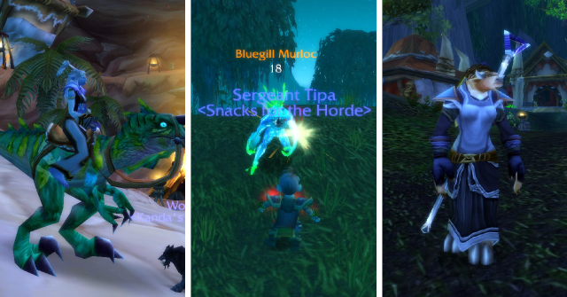

# World of Warcraft: I fail at WoW.

Amazingly, I don't think Blizzard has ever offered me free time to check out WoW once again before. They DID send me a trial disk for Burning Crusade after it launched, but you had to have an active subscription to give it a shot. When I checked out my account page, there was the free week offer, there was an offer for 10 free days of Burning Crusade, there was the link to download all the game files in case I didn't have them.... It was a warm, fuzzy feeling. They really wanted me back!

All I had to do was merge my WoW login with my Battle.net ID... easy enough... and download just over 4 gigs of data... at 2.6 Kbps. According to the timer on the installer, it would be finished in ten million years, just in time for the Sun to go nova.

Friends on Twitter suggested downloading the free trial, and just logging in with my account info. That was no better. I went to Google, and it led me to FilePlanet. FilePlanet had the free trial AND it downloaded a hundred times faster! It still took it most of the night and through the next morning while I was at work. Turned out that free trial was an older one, for the WoW patch 2 era. WoW wanted immediately to patch it through its history since then. The WoW installer was, THIS TIME, working pretty fast. 3.5 gigs of data for the first patch to bring it up to 3.0, then smaller amounts for 3.1, 3.1.1, 3.2, 3.2.1, etc. It's downloading 3.3 right now, I believe, in preparation for next week's patch.

After just a few days of downloading and installing, I could log in to WoW. There's still problems -- it doesn't remember any of my settings for some reason, so I have to reselect my realm and video settings each time. But! It's World of Warcraft! It's cool playing WoW, you feel in tune with the entire population of the Earth. I'm not playing some "other" obscure-o game, I'm playing the ORIGINAL. I'm in ORGRIMMAR, trick! And everyone knows exactly where I am. Between the mailbox and the auction house, right? You know the spot.

NOW what?

I remembered what I was doing the morning I quit WoW. I was working on some quests with my level 25 Tauren druid and couldn't think of any reason why I needed to finish them. I logged out, unsubscribed, and haven't touched it for three years.

What I needed on my return was some incentive. I subscribed to 38 Studio's Azeroth Advisor, which gave me some hints on where to go. For my 60 priestess Kanda, it advices a trip to the Outlands. For my 32 rogue Tipa (guild leader of the Snacks for the Horde!) it suggested getting groups for Razorfen Downs and Scarlet Monastery. And for Etha, Gnomeregan and Blackfathom Depths. I have great memories of all those places, aside from the Outlands, a place I've never been. (Azeroth Advisor told me how to get to it, though).

Even when I did play, WoW was nearly impossible to manage without the help of add-ons. Raiding as a priest was as simple as pressing one button for Decursive and another button for Healing, and watching the screen for instructions on where not to stand. I understand they have nerfed those particular add-ons to make raiding at least a little challenging, which is a very good thing. Nonetheless, I wasn't going to be the only WoW player without a full set, so I went to Curse.com and loaded up on them. QuestHelper, Auctioneer, some dps ones, better maps, all sorts of stuff. It's easy; the Curse interface lets you get them by the shovel-load. There's even one that tells a rogue when to sap, what poisons to use and when -- it's all very professional.

QuestHelper IS aware of flight paths, but doesn't know YOU have them until you actually go to one and an "a-ha!" moment occurs and suddenly the little marching ants march to the flight master instead of directly across a swamp. I was halfway to Dun Morogh before I remembered there was a flight master in Menethil Harbor. When I went back to take it, I wandered off to the docks and saw a boat I didn't remember seeing before, one that went to Durotar. I took it and came to a dock city where city guards were taking down a giant sea monster named Tethys. It seemed like a good idea not to linger.

That was Tipa, my sole Alliance character. I logged back on to Kanda, the troll priest, and decided to get some of those old quests out of the way before I headed to the Outland. Blackwing Lair attunement quests, DON'T NEED. All the Zul'Gurab quests, DON'T NEED. A quest for Upper Blackrock Spire? Really? DOn'T NEED. I was left with a good selection of quests that seemed to deal mainly with battlegrounds or other PvP objectives, so I set out and followed the marching ants to a balloon and thence to Stranglethorn Vale, where I had a faction turn-in for a Zul'Gurub quest I'd apparently finished a long time ago. On the way I was attacked by a low-thirties troll NPC, and nearly killed.

I'd totally forgotten how to play a priest. I apparently wasn't even shadow-specced any more (oh, they reset my talent points. Gee, thanks.) I decided to choose an easier class.

Tipa had to kill a lot of orcs outside Menethil Harbor, set catapults ablaze and then kill a chieftain. A rogue is a rogue anywhere, and I didn't really have much trouble once I remembered how to pull. I keep hearing how easy WoW is these days, but maybe they mean how easy it is these days if you have up-to-date gear. I actually was doing fairly well until I fell off a wall and out of the encounter.

I decided to give the druid a try. In her heyday, I was able to solo many portions of Shadowfang Keep, one of my favorite instances. Prowling from boss to boss in cat form. QuestHelper advised me to finish off some Ashenvale quests, which seemed like a good place to start.

This night elf and I were working our way through a satyr camp when it occurred to me that we were enemies. Weren't we? Way back when, you'd never see an Alliance and a Horde working together so casually. One or the other would /flag themselves for PvP and taunt the other. Friends would be called in, and before long, there'd be a fight going with lots of death and people running in from graveyards. We had lots of fights right there in Ashenvale, in fact, some really good ones. Now, we're all friends, good buddies, and we work together in love and unity, Alliance and Horde, 2GTHA 4EVA. *hug*!

It took awhile to remember how I used to druid. I remembered I used to shift between forms all the time. I'd root and nuke a few times, use my root shield buff to root them when they hit me, step back, do it all over again, toss in a moonfire and a rejuve, shift to bear form, tank them until they ran, then shift back to druid and finish off with another moonfire.

Took awhile to remember that. Probably an add-on for it.

I still am bitter that I don't remember how to play a priest. I kinda failed at that, and I don't know if I should try soloing in Outland with my skills so poor.

I did start a new character, a blood elf mage, to try out the Burning Crusade. Point and shoot. Nothing to it :) Maybe starting from scratch is the only way to really appreciate all the changes three years has brought to the world. of Warcraft.

