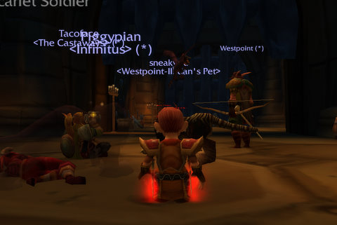

# World of Warcraft: Random Dungeons FTW

I signed up for World of Warcraft just for the free week they offered. I played a couple of times, said hello to my old characters, started a new one, realized I had both no idea how to play and no particular reason to do so, and was about to bid WoW adieu until Cataclysm. I'd always planned on playing a little when the next expansion was released.

Then patch 3.3 came, and with it the new Automatic LFG thing. Pick between a random "classic" dungeon, or some specific dungeon, select your party role (always damage in my case, but those who can swap between tanking, healing and damage can signal which they want), after awhile you get whisked from wherever you are to the Scarlet Monastery.

Well, maybe that's just me.

Azeroth Advisor SAID I'd probably be ending up there. In fact, I should be getting another edition from the Azeroth Advisor crew pretty soon because I leveled three times (admittedly, I had maximum rest experience -- three year's worth).

Well, no longer. From following QuestHelper around, getting a great talent build from [RogueBuilds](http://roguebuilds.com/), re-learning about poisons and as many instance runs as I wanted to queue for, I've just kinda had fun.

Which is bizarre because I wasn't having fun when I quit, yet the game hasn't changed that much, at least for low level characters. It's just that random dungeon thing hit some sort of perfect storm with me. I can run around and do some quests, then queue up for a dungeon, do Scarlet Monastery (library once, armory twice), watch every bit of loot go to people who rolled need for things they clearly didn't *need*. The fluff dog whistle from the dog trainer? C'mon, that's a greed item.

Nonetheless, I wasn't there for the loot but for the fun and to relearn the game.

If I wanted achievements, I got them. I got a couple just for doing the two wings of SM I did. I also got special gift packs on the completion of two of them (probably not on the third because I was dead), each of which had a bit of blue jewelry.

Anyway, I decided to subscribe to WoW for a month. I don't know where I'm going with it. I won't be joining another guild, I'm Head Snack of Snacks for the Horde! You just don't give that up! But with this random dungeon feature, there are things I don't need any more to enjoy WoW. And those things are a) guild mates, b) LFG channels, or c) friends.

That's it. With patch 3.3, WoW has finally managed to get rid of any need for friends to do dungeons.

