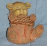

# Five things you don't know about me...

 [MrrX](http://mrrx.wordpress.com/) [tagged me](http://mrrx.wordpress.com/2007/01/04/five-things-about-me/) for this (and also [Amber](http://ambernight.org/archives/2006/12/28/453)... OOPS)... so here it goes... Five things about me you probably don't know...

**I'm not a New Englander.** It's a big point with me that I grew up in Massachusetts and went to high school and college in New Hampshire. But I was born outside of Seattle while my dad was working at Boeing. Where the hospital I was born once stood, a K-Mart stands now.

**I'm a musician.** I used to play flute, recorders and pennywhistles in an Irish contradance band called the Crabapples back when I lived in Monterey. We were a kinda big band at one point, and one night we crammed onto that tiny stage at the juice bar in Pacific Grove which had an open mic night. It was hilarious.

**I was a winner in the 1986 Obfuscated 'C' Contest**. I'm never sure if I should mention that on resumes. It's like winning the Worst Audition award on American Idol. Sure, you were *on TV*... and what's more, you were *trying* to sing badly...

**I have six sisters.** Well, three of them are step-sisters, my stepmother's girls. The family name ends with my generation! Hoorah!

**I still have my teddy bear from when I was three.** His name is Orange Teddy. Real imaginative name... I knit his shirt when I was a kid. I'm told he had fur once... I have a special way of holding him that only he and I know, so he'll know it's me and will stop crying.

I'll have to pass this along to the only two people left who read this blog and haven't been tagged already, [Amber](http://ambernight.org/) and... HEY WAIT! SHE TAGGED ME! Well, her fault for doing it around when my grandson was born... Blogs were the last thing on my mind :)Okay, I'm tapping [Razak of Norrath Living](http://www.norrathliving.com/) and [Tide of Tide's Horizon](http://tidehorizon.blogspot.com/). Out with the dark and dirty, guys!
