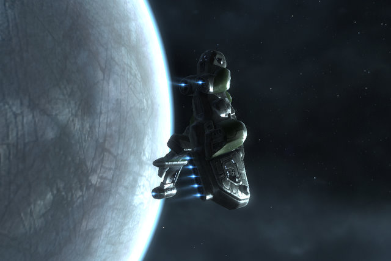

# EVE Online: Pinneau/Ethomas Industries christens first ship

Named "Hathor" after the Egyptian goddess who welcomed the dead to the afterlife, the first Helios covert ops frigate born of the collaboration between Tipa Pinneau and Ethomas rolled from the Federation Navy yards in Eglennaert last night to the cheers of the workers. It rounded the station twice before cloaking and heading to parts unknown.

I don't know if there's any way I can make back on Tech II ship building what it cost to get in the business. I did manage to get an Incognito Ship Data Interface for only 32 million ISK. The datacores for the invention attempts were supplied *gratis* by my research agents. The Imicus blueprint copies that form the base of the Helios blueprints were copied from an unresearched Imicus original blueprint. My one success in four tries at a Helios bp resulted in a very poor quality product. I've since done some material research on the Imicus original, so perhaps the next one will be a little better.

Ethomas spent about 15 million ISK for the Helios components; I had the skills necessary to actually put them all together. It took 13 hours and 20 minutes to make the ship, and untold weeks for Ethomas to learn to fly it. It was a true collaboration.

While my main focus is still making Hammerhead II drones, I'm trying now and then for another Helios bp of better quality. If there's 5 million ISK profit to be made from them, then it's possibly worth the time to make one now and then. Level 4 missions, though, make that much in a couple of hours with bounties and salvage taken into account. It's just one step on the road toward more complicated ships -- in the coming months, I will start working on my Ishtar heavy assault cruiser.

I am really loving invention and manufacturing. I hardly ever do missions now, and when I do, it's just the fun ones. Whether or not I ever turn a profit on it, the fun is worth the work.

