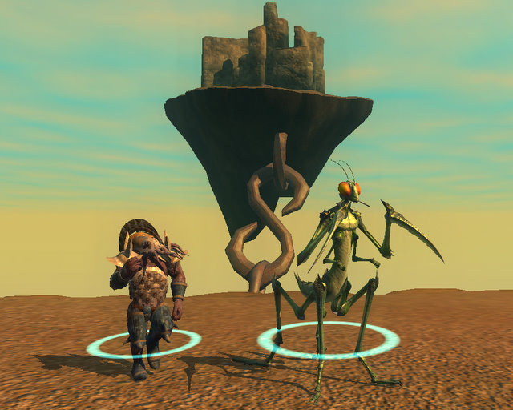

# EQ2: Battlegrounds 2.0

*Posted by Tipa on 2010-01-28 07:50:34*

Yahoo! [had this to say](http://uk.videogames.games.yahoo.com/pc/previews/everquest-ii--desert-of-flames-9e57c6.html) about EverQuest II's new battleground system:

> First off, PVP will primarily take place in an instanced arena. It's not going to be just deathmatch, kill-or-be-killed gameplay, though; apparently, alternate game modes like capture the flag, hold the line, and seek and destroy will be included, and SOE hints at some kind of custom game mode creation as well.

GameZone gushed about it, too!

> First up is that PvP (Player-versus-Player) will be finally entering the world of Norrath (in EQII, at least) with arena combat. But the arena combat is not limited only to levels of a certain level (the level cap is going up to 60). Players of any level will be able to jump in and compete, if not as their avatar, then as an arena champion of a level that is appropriate for the players participating in the fight. 

Gamespot [has a deeper analysis](http://www.gamespot.com/pc/rpg/everquestiidesertofflames/review.html?page=2) of the EQ2 Battlegrounds:

> The arena is one facet of EverQuest II's new player-versus-player combat system, which along with dueling finally brings a smattering of PvP to the realms of Norrath. Players can request duels of other players at will, and there's even a feature that allows bystanders to wager on the outcome of the contest if they so desire. Wandering around even the lowest-level areas, we found a number of players willing to drop their quests and challenge each other to short contests of skill. The arena is a feature found only in the city of Maj'Dul, and you can walk up at any time to set up the game of your choosing. There are three game types in the arena--team deathmatch, capture the flag, and destroy the idol--and you can easily set victory conditions, time limits, and whether you want to allow spectators outside the game to watch.

GameSpot goes on to note:

> It's a grand setup, but your chances of actually participating in these mighty arena contests probably aren't all that high unless you've managed to already recruit a fighting force. The arena stands large and empty much of the time, particularly on weekdays, with the occasional player trying to fire up a pick-up game that has a good chance of petering out due to lack of interest. The arena seems to be a nice, if underused, player-versus-player outlet, but it's hard to gauge the future of PvP in EverQuest II.

Long time EQ2 players may dimly recall that battlegrounds were added to EverQuest II back in its very first expansion, the Desert of Flames. You could go in either as yourself and play various CTF, zone defense or FFA scenarios, or go in controlling an avatar, which you could buy or win in groups doing adventure content. (This expansion also added dueling).

After the first few months, hardly anyone played the arenas, even though SOE would expand the arenas to Qeynos and Freeport to make it easier for players to participate.

The DoF arenas gave out nothing but fun and bragging rights. If you won a huge number of matches, you could win small banners for your home that marked your victories. In an Achiever game, a sense of satisfaction can never be enough. When players found there was no real advantage in doing arenas, they stopped doing them.

Now SOE [has gone back to the drawing board](http://www.everquest2.com/gameinfo/battlegrounds). 

Instead of arenas being open to people of any level, the new arenas will be available only to character level 80 and above. Instead of using avatars in order to make battles more about skill than gear, the new arenas will pit people in the best gear and abilities against people with lesser gear and abilities, or vs classes that are tuned more for a support role.

SOE looked at the Desert of Flames arenas and decided that their failure was not being enough like World of Warcraft.

The new arenas will (like WoW) award PvP armor, and (like WoW) will point out the imbalance of certain classes in PvP. In EQ2, ranged classes will have a powerful advantage over melee, which will lead to inevitable nerfs to ranged classes that will carry over into the PvE world. Classes with crowd control capabilities can expect to find those powers scaled way back, because it's not fun to be rooted and nuked. And so on.

PvP servers came late to EQ2; SOE has (until now) always emphasized the excellence of their PvE gameplay to distinguish the EverQuest marque from other titles. Since PvP was not baked in to the game from the beginning, it's never really taken off as a gameplay style.

Assuming the new EQ2 arenas copy well from WoW, we can expect arena fights to consist half of mad scrambles to kill anyone they can, and half of players trying to find a quiet place to AFK so that they can win their emblem/token/shard at the end in order to earn the coveted PvP armor that is the system's main draw.

I haven't heard anyone get really excited about the new EQ2 arenas, but maybe I'm not attending the right marketing meetings. If arena PvP is what players have been waiting for, I can't see why they wouldn't already be playing WoW, or Warhammer, or Call of Duty 4, or Counterstrike, or Left4Dead, or any of the dozens of other REALLY POPULAR games built entirely around arena team combat. For all the other games mentioned, you can make your character and be in an arena in ten minutes.

EQ2 is the only one that asks you to get 80 levels through PvE first.

