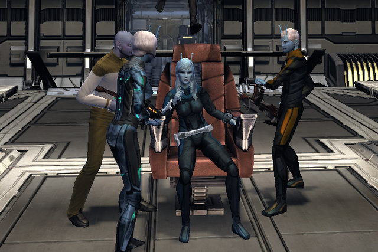
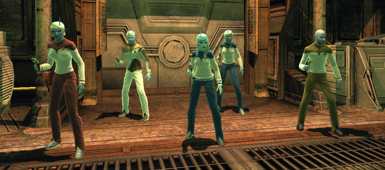
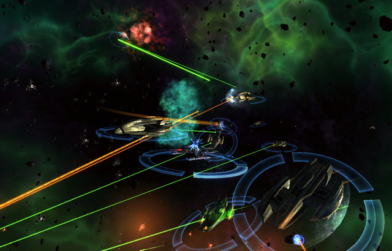

# Star Trek Online: My Crew is Revolting.

Stardate 2010.02.01, U.S.S. Newton, on patrol in the Arucanis Arm off Regulus Sector, Captain Tipa D'zoph in command.

We have been trapped in this nebula for days. First Office Sryn and his science team are attempting to discover what force is keeping us in this dense maze of gas and gravitic anomalies, but thus far he has made little progress. 

We had just finished tense negotiations with Klingon terrorists who vowed to disrupt peace negotiations between the Federation and the Klingon Empire. Federation security forces under command of Lt. Mira Paris managed to drive the terrorist's leader into hiding among the spaceways. As we the nearest Federation ship, Starfleet ordered the Newton to pursue.

Due to damage sustained in orbit, the Klingon's cloaking device left behind a plain trail of chronoton particles that led into the Arucanis Arm. Our short and long range scanners were useless. We have been playing a cat and mouse game among the gravitic anomalies and rogue systems ever since.

One thing has become very clear: the Klingons have been building a substantial presence in the Arm. They or their Gorn confederates have been found in nearly every system we have explored.

Lieutenant Rank 10 at the moment, just a few bars from Rank 11. That gets me the promotion to Lt. Commander and a new ship. I was hoping to reach that rank this weekend, but Star Trek Online's persistent inability to stay up for more than a few hours made that impossible.

I don't know how people level so fast! But I have learned some tricks to make things go a little faster.

For space missions, I'm using a trick I saw some people using in beta. Mines. It's all about the mines. You can buy a Mark II Mine Launcher right in Starbase Alpha. I put that in my aft weapons slot (the only position it can be placed), have two dual disruptor beam Mark IIs in my forward slots. I get within 10km of my target which can be ANYTHING. slow down to a crawl, start laying mines and taking out the opponent's shield. By the time it gets to me, I have ten or more mines waiting for them and its facing shield is gone. The mines move in, explode, the battleship or whatever is down 30% on the hull, and after that it just can't escape the hurt, whereas all *I* need to do is keep pushing power to forward shields.

This works less well when surrounded by ships, but is still effective. ANY ship that blunders into your mine field is going to hurt, but the pain really comes when you have removed the shields first with the disruptors.

Fighters and drones will usually destroy themselves. NPC ships simply don't avoid PC mine fields.

There was one ground mission I simply couldn't do. I spent more than an hour trying to take out this clump of Klingons which contained a high level Swordmaster (Bat'leths ignore your personal shields and HURT) and a really huge Klingon I'd never seen before, but who really put out the damage. I just kept dying to that guy. Killing me was this guy's purpose.

I guess he really didn't like Andorians.

Since Klingons hate me like a redshirt, I had to get a little smarter. The answer? Mines, again. Here's my new strategy.

I have an engineering bridge officer who can lay down a barrier of chroniton mines. I set a rallying point a dozen meters or so in front of me. My away team runs over to it. I order the engineering officer to lay down some mines. I then target an enemy and order my away team to focus fire on this one person -- I like to take out the specials first. For Klingons, this means the Targ Handler, Sword Master or Munitions Officer. The target ignores my away team and rushes right to me.

BEWM. Into the mine field. If they live through that, I start whacking them with the butt of my sniper rifle while the away team turns and gets free flanking attacks at its back.

After that, I focus fire on whichever Klingon hates me the most. My rally pointed away team gets continual free attacks, and whenever any of the enemies gets exposed, I snipe them down and they fade away, old-school Trek style.

I still die when there's a lot of enemies, but not as often. Rally points and mine barriers have made ground missions a LOT more fun. NPCs just hate me so much more than my bridge crew. Why would I not take advantage?

Today is Star Trek Online's official launch. I don't know if I'll be able to make it to Lieutenant Commander tonight. It depends on whether or not the servers stay up.

After all the open groups in the (newbie) Sirius Sector, I'm amazed at how few there are in the (almost, but not quite as newbie) Regulus Sector. Aside from the "Enemy Contact" open missions, I don't think I've met another captain on any of my missions. I'm hoping all the new players that start today step up and help fight the good fight with me as I head into the Neutral Zone.

If I can FIND the damn place. I've BEEN to the exploded remains of Romulus. You think you'd HAVE to go through the Neutral Zone to get to Romulus, wouldn't you?

Tonight, though -- Starfleet has a huge list of places for me to explore. Maybe one of those missions will earn me a promotion and a NEW SHIP.

After fights like the one above (an Enemy Signal open mission in Regulus Sector), I could really use one.
