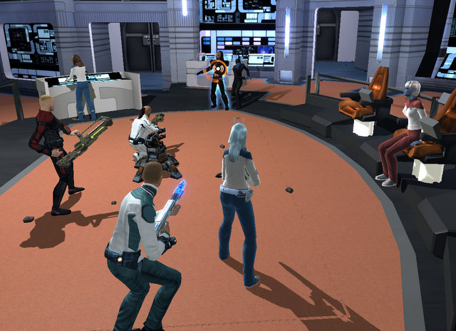
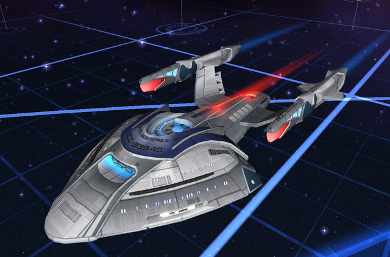

# Star Trek Online: Cryptic, pat yourself on the back

*Posted by Tipa on 2010-02-03 00:56:01*

Everyone expected problems with Star Trek Online's official launch. Color me shocked. I found no login queues, no crashes while zoning, no problems of any sort tonight. Things were going so well, I did a Gorn fleet action for my level and returned to Starbase 01 for my promotion and new ship.

Earth space was as crowded as expected, and aside from people wondering where their "Classic" Enterprise pre-order bonus was, I didn't hear any complaints about bugs. And just in case someone still is wondering where Admiral Sulu is, every NPC in the Starbase seems to be loudly fixated on the answer to that very question.

Oh, and Cryptic? It's "Hear, hear!" not "Here, here!".

Aside from spelling errors, it was smooth as silk.

I agonized over my ship choice and finally went with a science vessel, as I always kind of knew I would. I loved the science ship stories in the ST:Voyager, Wrath of Khan and so on, even though they usually met with bad ends.

I was so happy with my new ship that I spammed my friends list with invites to check out my bridge. Soon the place was jumping. My bridge crew stolidly kept working while we all danced, practiced sitting in the Captain's chair, and checked out each others uniforms. I know I'm going to miss some people, but Angry Gamer was there, and Syp of [Bio Break](http://biobreak.wordpress.com/), Peter Smith of [Dragonchasers](http://dragonchasers.com/), [BlueKae](http://www.bluekae.com/), [Longasc](http://twitter.com/longasc), [Almagill](http://twitter.com/almagill), and a BUNCH of other people (and I hereby apologize for missing YOUR name, it's late, I'm tired, and I didn't write names down). Later, I met up with Vikund of [The Ancient Gaming Noob](http://tagn.wordpress.com/) in his chat channel (TCXX, same as EVE Online).

We had a lot of fun. Longasc infested everyone's inventory with Tribbles, and we played a few fun rounds of Disintegrate the Klingon, the 24th Century's favorite party game.

We followed the Klingon back to his ship and disintegrated him there, too, just to say we had.

After the party, I returned to Starbase 01 and got some fittings for my ship. I had an extra aft weapon slot, space for a new science console, and the ability to promote a science officer to Lieutenant, which gained me the ability to confuse enemy ships in a 3km radius from the target into firing upon each other for 12 seconds. I requisitioned an Andorian science officer to fill one of my extra crew slots, but it turned out I already had her twin, so I threw her back and got a Klingon science officer instead.

I hired a new tactical officer as well, but he isn't going to last long. I have a Borg officer coming once I get my retail package, and he or she will fill that position.

I still haven't decided on weapon loadouts. I kinda want to wait and see what sort of green or better Mark IIIs I can find. The ones at Starbase 01 require exploration points, so I am back in the Arm doing exploration missions, and I will probably pop over to Memory Alpha and see what they have available at some point.

I'm really liking the "episode"-type missions. I really DIS-like the kind of exploration mission where you have to run to a starbase and buy ten or more of some item they just HAVE to have. I have half a dozen of those waiting for me to get around to them. I'll probably just wait until I can make a really huge shopping list and get everything all at once, complete a bunch of missions at the same time.

If I can get some of those rare Mark III bits of gear, it will likely be worth the hassle.

Great launch, Cryptic!

