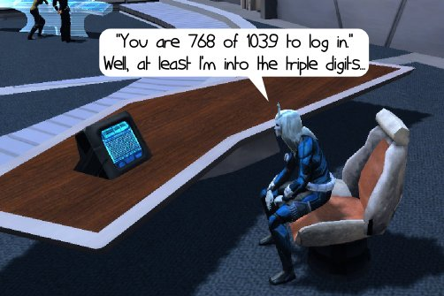
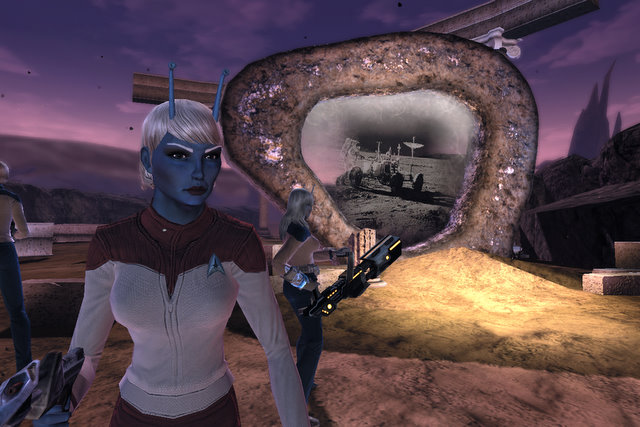
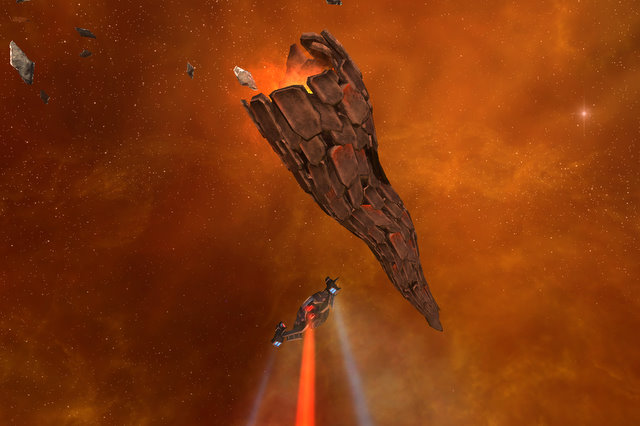
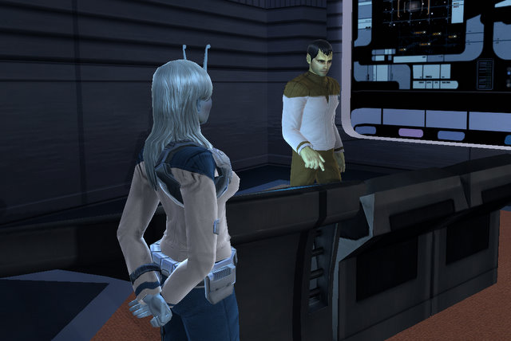
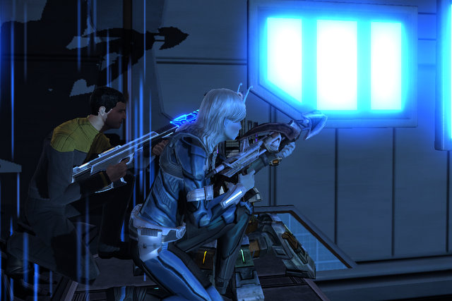
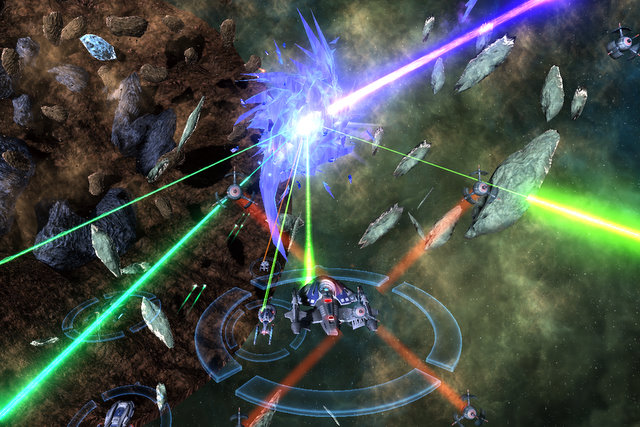

# Star Trek Online: One Week Later

It's a week after launch. I'm Lieutenant Commander rank 8 -- level 18 of 50. Those who have rushed to the end are paying the price for being first. Skills that don't work as described or don't work at all, a general lack of content. A friend of mine just can't enter the Sol system, has to start a new character every time. It's not been a spotless launch.

But when you're in the game, just doing missions and exploring enemy starbases... it's pretty cool.

Any game based on a famous intellectual property is going to have a lot of "must see" places. Lord of the Rings Online has its Weathertop, Star Wars Galaxies has its Mos Eisley, and Star Trek Online has its City on the Edge of Forever.

The Guardian of Forever is a strange artifact in the Gateway system that has the power to send people into their own world's past. Tampering with the past via the Guardian USUALLY tends to remake the entire universe, and that's what happens here. You must return to the past -- the time of the original series -- and help the original USS Enterprise stop the future Klingons from tampering with their race's destiny.

The Mirror Universe? That's in the game. Tribbles? THEY are in the game. Patting one can give you a variety of buffs, too! You should never leave your tribble behind when you're out exploring the vasty deeps. Seriously. DON'T leave it behind, especially where there's food.

Many people have found themselves to be accidental tribble breeders.

The storyline missions that send you into the famous bits of Star Trek Online, like the mission to once more take on the ravenous, world-eating Doomsday Device, aren't nearly enough to level you to the next rank. You'll have to spend plenty of time on the more bread-and-butter aspects of the game to get ahead.

There's good reason to do so outside of pure experience. Doing the randomly generated exploration missions (explore three random systems in a nebula and do whatever seems necessary) nets you badges of exploration, which may be exchanged in the requisitions area of a starbase for uncommon gear, better than can be bought for energy credits.

Patrol missions take you around to every planet in a sector, and these pre-written episodes often net uncommon to rare gear, or occasionally, a new crew member.

Crew members are as vital to your progression in Star Trek Online as your ship. You don't just gear yourself up; you need to make sure each of your crew has the skills and gear to make it in Starfleet. That opens up a vast number of strategic possibilities; you can have an away team member specialize in opening up targets of opportunity ('expose' attacks) so you can take advantage ('exploit' attacks), which often kill an enemy in one hit. Or you can draw an enemy's attention so that your crew can get high-damage flanking attacks.

In space, your crew gives your ship special abilities -- like sensor jamming, high-damage phaser barrages and other stuff. Taking on a new crew member can be quite daunting. Sometimes you just might want to pick their best ability and have them teach it to an existing member of your crew.

You can also pick up new skills and train crew members in your same area (science, tactical or engineering) what you learn. I believe this is the only way to have your crew members learn rank III skills. Common crew members have rank I skills, uncommon and rare crew members have one or more rank II skills, but you alone can learn rank III skills. Unfortunately, I don't believe you can trade crew members that you have trained up, though the care and breeding of crew members could be an exciting mini game at some point.

|  |  |
| --- | --- |
| 

 | 

 |

Some community members have made character creation a game of its own, and have produced guides showing how to make [Cardassians, Romulans and Jem'Hadar](http://stotricorder.com/index.php?option=com_content&view=article&id=76:how-to-create-a-cardassian-&catid=1:latest-news) from the bits and pieces in the alien creator.

I've seen bobble-headed Little Green Men, bird-looking aliens, all manner and types of species running around the starbases....

As fun as flitting around the galaxy blowing holes in Romulans IS, sometimes you just want to have a little quick fun. For those times, PvP is just the thing.

I play a science officer, and I crew a science ship. This gives me the awesome powers of healing and debuffing. There's nothing quite like being in a PvP fleet action against player Klingon forces and watching their look of stunned surprise as their shields suddenly vanish -- or they are held in place by my tractor beam as the rest of the almighty Federation comes down on them. I'm surprised Klingons even queue up for space PvP.... last one I did was no kills for the Klingons, almost every Federation ship was in the double digits. Klingons are way too in love with their cloaks to think strategically.

The game is far more balanced on the ground PvP side. It's the only place, by the way, where you can see the REST of the ship, aside from just the bridge. Having engineering officers setting up portable turrets and shield regeneration devices, science officers getting their stuns and heals ready, and tactical officers ready to let loose with the major whompass as screaming, directionless Klingons come blundering in with disruptors flaring.... all is good.

And you win badges for PvP gear (although I haven't found where that vendor is, yet).

OMG! The Crystalline Entity! Yeah, that is NOT an easy thing to defeat. That's one of the fleet actions in (I believe) the Alpha Centauri sector, and the closest thing to a raid at this time. Longasc finally finished the fight by ramming it at full impulse.

Star Trek Online has its share of launch problems. The promised high-end content dealing with the Borg is not yet in, neither are "real" raids. Guilds are still being formed, and most will likely wither after the first rush of people leave. My plans are to wait for a blogger/tweeter guild, but for now, we have a custom chat channel (ask me in game for the name).

It's my hope and opinion that these launch jitters will stabilize into a great game. The ball is in Cryptic's court, now. They have to make everyone happy, and they have maybe a week to do it. After that, they need to step up and create high end content, or they won't be able to keep all the people they have. It's a HUGE job, and I wish them the best of luck because right now -- it's the best damn Star Trek game I have ever played. Star Trek Armada II was fun in its day... but this has it beat.

