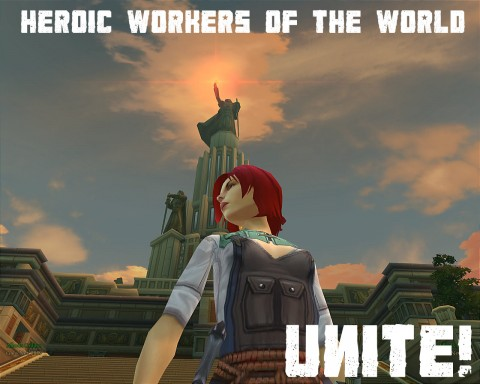

# Allods Online: Workers of the World!

[caption id="attachment\_4736" align="aligncenter" width="480" caption="Click to Enlarge"][/caption]

Allods Online is fun enough, and I guess it's cool that everyone's characters speak and read Russian because, hey, it's an overseas game not afraid to show its roots. Or too cheap to localize the voice and art assets, one or the other.

Yet I still feel a little uneasiness toward the game. Not because I can't handle a little Cyrillic here and there. Not because it doesn't depart far enough from its influences to really stand apart from the crowd. But because....

Maybe it's still the remnants of growing up in the Cold War. Growing up knowing that at any moment, the Soviet Union could decide to kill us all. As a child, all I knew of Russia was that they wouldn't be happy until every American was dead.

I cannot shake the feeling that this game is another, subtler attack on the Western world. This whole kerfuffle with gPotato deciding it is just good business sense to utterly gouge players with the cash shop when most of the US is struggling under the worst unemployment in decades is just lunacy.

Somewhere, there's a cabal of grim-suited business people chomping cigars and downing vodka, more pleased than they have any right to be that millions of computers across the world are running Russian software that can take control of those computers at any time.

Call me paranoid, I guess I am.

