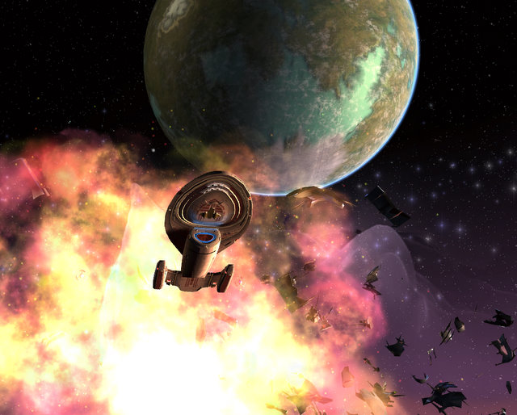
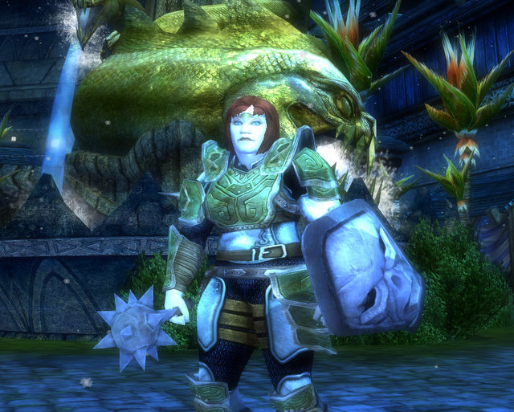
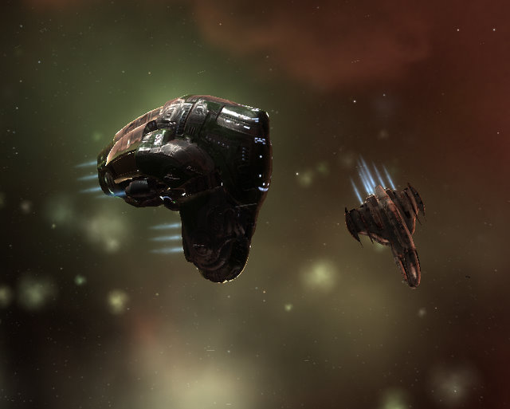
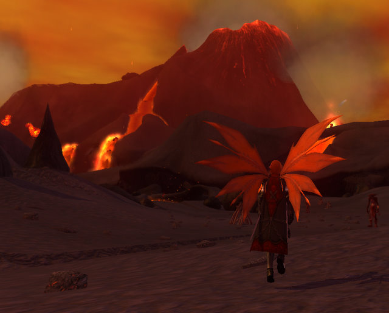

# Weekend Gaming: EVE, EQ2, STO, DDO, Dragonica Online

*Posted by Tipa on 2010-03-01 08:37:41*

I've come to realize, over the years, that I really suck at MMOs. Easily distracted and easily bored, the sort of long-term, intense concentration that is the mark of the truly successful grinder is impossible for me. I can't be the only one; the newer crop of MMOs seem made for people with short attention spans. World of Warcraft's "Looking for Dungeon" tool lets you defeat the ultimate evils of Azeroth half an hour at a time. EQ2's newest mission maps reward you if you can finish the entire instance before the necromancer is done buffing her pet.

Star Trek Online has its "episodes" -- all the story they can fit into 45 minutes. You get a little story, then you have some ship battles. A little more story, and you beam down to the planet to kill some folks. Some more story, and you enter a building to wipe out some industrial replicators.

And it's fun! I'd changed up my Science Kit last night, so most of my old abilities were going with the old kit, but the new one worked with "nanites" -- the microscopic miracle machines that are [the remedy that cures all ills](http://www.englishclub.com/ref/esl/Sayings/Quizzes/3/Death_is_a_remedy_for_all_ills_992.htm). I now have packets of GOOD nanites, that infect me and those around me and heal me (or my allies) up to three times, as needed. And I have packets of BAD nanites, that infect enemies and cause them to take more damage from attacks. As well, I can tune my tricorder to send out all sorts of disruptive signals. So that's fun.

I really enjoyed roaming the galaxy in my Galaxy-class cruiser, but I've been watching the last season of Voyager and just had a hankering to fly it myself. For just 140K energy credits (or the price of a common Mark I tactical console if bought from the Exchange), I bought my own Intrepid-class long range science vessel. Unlike the Galaxy, Starfleet engineers have given the Intrepid the ability to TURN.

The upgraded science officer positions also let me unleash the awesome power of the Viral Matrix III, which holds a ship meek and defenseless for 16 seconds, during which time I dismantle its shields and feed it plasma torpedoes until it's full.

Finishing last night's episode opened up "The Tribble with Klingons" -- I can't wait to see what that one's about! @Longasc sent me a blue tribble last night, I'll definitely be taking it along on the journey.

We met again in Dungeons & Dragons Online again last night to further explore The Waterworks, which the game helpfully describes as 'the heart of the kobold infestation in Stormreach". Well, what part of Stormreach ISN'T infested with kobolds? The Waterworks by any other name would be a sewer, and Stingite, Shintai and I trundled through pipes and tubes and traps and oozes for hours... just to get to the instances. I know it's SUPPOSED to be subterranean and all, but why is it so dark? You'd think a dwarf would be able to see better down there.

My [Hobbesian cleric](../index.php/2010/01/08/dungeons-dragons-online-a-hobbesian-cleric/) leveled to level 4 last night, the last of our group to do so. I've been lagging behind on the solo adventures I've been meaning to do so that instances open at the Hard level when we come to do them as a group. Since nobody had opened up the Waterworks instance we did last night solo, we had to complete them on Normal. So, we'll be back at least a couple more times to gain favor and better loot.

The normal level adventures, done with a hireling, are almost the perfect solo gaming experience. At my own pace, I find more reasons to use the various wands, potions and spells that I find here and there. In a group, it's all I can do to keep up and try to whack a goblin and toss a heal or buff now and again.

Still a great game for those who like dungeon crawls. I haven't yet spent any money on the game, but that's more because I have no idea what I would want to buy with it, than any reluctance to do so. I can't imagine starting another character and having to do all those instances over again. If I did, I'd be playing a drow!

It was not a good weekend for me in EVE Online. Buoyed by my success with Ishtar blueprints, I bought 16 mechanical engineering datacores at 290K ISK each and, given the suddenly high price of Vexor blueprints, set a Deimos and a Phobos blueprint into invention. Both of those are based off the Thorax blueprint, which was very cheap. I used a two-run decryptor on both. I bought a Tristan original blueprint as the first step in the Nemesis Initiative, made some copies and put a Nemesis blueprint into invention as well.

All three invention jobs failed. Nobody bought any of my Tristan blueprint copies, either. The only thing I DID sell, was my last Ishtar blueprint.

I'm running short on decryptors so I headed out in search of more radar complexes. I found one -- but it was empty. Every plex I scanned down was empty or was already taken. I found some Serpentis anomalies and cleared them, but the rewards were minimal.

If it hadn't been for the level 4 mission I'd done with Kasul, the weekend would have been a total wash. That was a glorious mission. I dragged my Dominix battleship out of mothballs to tank, and my alt was in her Prophecy to help with the smaller targets. Kasul had his golden new Nemesis stealth bomber, and he was just sitting at range lobbing torpedo after torpedo into the mess. Things died FAST. After that mission, I started my alt training the Amarr version of the stealth bomber, the Purifier. Looks like a lot of fun.

I patched up EverQuest II to have a look at the changes. The AA tree for my troubadour was entirely changed up, so much so that I hardly knew where to spend my points. I visited the research assistant and got my latest spell, then started him researching the Master version of Perfection of the Maestro II for me.

As soon as I finish one game, probably Star Trek Online at this point, I'll be heading back into EverQuest II, but as what class, I don't know. I feel that the need for troubs is minimal at best in groups, and even where they are wanted, I'm a pretty poor one. I don't have a full set of AAs yet, and what groups want is an AA right at the end of the tree. That's pretty much all they want. LFG shouts usually are very careful to specify that the kind of bard they want is a DIRGE, or failing that, an enchanter of some sort for power regen. All fairly depressing.

My adventures with Sirhyl left my Fae berserker, Scatterfall, at level 48. Tanks have to deal with unrealistic expectations as to their abilities to survive ANYTHING all the time, but I'm thinking, with all sorts of healers on my second account, that she would have a better chance of living through the leveling process. I two-boxed my troub and inquisitor to 80, and most of the time, the troub was being carried by the inq. There was a solo fight in the Kunzar jungle where you had to fight an increasingly difficult opponent -- the shackle series. My inquisitor sailed through those without trouble. I had to do all sorts of sneaking exploit tricks to help the troub through.

I may just switch things around, and carry the troub as power regen and other buffs and just play the inquisitor as my main, level to 90 that way. Or betray Tipa to be a dirge (but give up my Mythical? That would be a very hard thing to do).

Lastly, I haven't been playing Dragonica Online much, but I've had a hankering to see something beyond the Port of Winds. I went through the very lengthy patching process -- must have been six or more patches to come up to date -- and spent a good hour learning how to play again by going through mission maps solo. Even on a weekend, there weren't many people running missions in Traitor's Ridge, so I wasn't able to finish up the storyline there. I DID ding to 16 Archer while farming Windia Beach for quest bits. I came across a huge boss bat there, too, but I wasn't able to get a good screenshot of it, as a high level player was one-shotting everything she saw, and I needed to concentrate on keeping my kill.

Fun as ever, and I have been sent to some of the maps on the other side of the Port of Winds. Leveling has been pretty slow; perhaps that's why I don't end up sticking with the game for any length of time. But best thing about F2P games is, they are always right where you left them when you want to play again.

I was invited once again to the No Prisoners No Mercy podcast this weekend, where the good Sisters Fran & Julie, Saylah of Mystic Worlds and I talked about the big questions of life -- Good vs Evil, Allods Online and Ubisoft's DRM, among many other things. While chatting away, I was in Wizard101. I did Sylvia's tower in the Necropolis and then a large amount of quest farming in the Drake Hatchery. W101 is so much fun to do while chatting, I find :)

