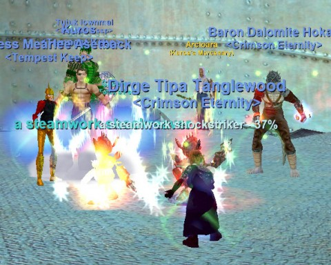

# A return to EverQuest?

*Posted by Tipa on 2010-03-25 07:10:41*

Based on helpful comments and e-mails from yesterday's post about choosing a game in which to immerse myself for awhile. I've decided to go with EverQuest, but to also keep checking out EVE opportunities while I complete some long-term training goals, AND to try out Fallen Earth at some point! Because it's clear that my brief experience with FE in its early beta wasn't enough to get a good feel for the game.

The day before yesterday, on the bus home, I'd just had this feeling that I needed to commit to a game. Being an MMO butterfly is all well and good, but to actually play the game you have to actually play the game, if that makes any sense. I'd been thinking about old guildies and it absolutely floored me to find some of the very ones I'd been remembering ONLINE, PLAYING and inviting me to come along.

Sometimes the universe can be hard to figure out, and sometimes it grabs you by the shoulders and pushes you where you need to be.

Last night, I returned to EverQuest.

[caption id="attachment\_4883" align="aligncenter" width="480" caption="Exploring Lower Guk as a level 50 \\"classic\\" necromancer"][/caption]

Dalanan was already online when I logged in, doing one of the three "classic" monster missions. The missions give you a level 50 character equipped with the absolute best gear a pre-expansion character could have, then send you off to one of the original EQ dungeons to hunt and kill and slay all the nameds. The team was about halfway through Sol B. I was added to the task and was required to hunt down Old Man McKenzie in the Plane of Knowledge and listen to him ramble on about how EQ was better when he was a kid, and they were GLAD to get a rusty sword as long as it wasn't TOO bent, etc. Walking uphill both ways through kobolds piled hip deep. You know how those old EQers get. Why, kids these days have it so easy, I oughtta.....

That's when you get to pick your class. I picked "rogue" because, why not? Serrated Bone Dirk in one hand and a *Burning Rapier* in the other? I remember the Burning Rapier -- I DID that quest! Took FOREVER to get that keg from the brewer in Blackburrow!

Anyway, the old man ports me in and I go running around, getting into trouble. I am advised that people normally do these monsters missions as casters, because they are just stupidly overpowered in old content, can invis and so on.

I go exploring too far and end up flattened by some fire giants, and make my sheepish way back to the dungeon in time for the rest of the group to finish it.

Next up: Lower Guk, dead side. (I believe Lower Guk: Live side is the first of the trilogy, but I missed that). I was advised to choose a necromancer.

I HAVE a mid-40s necromancer on Luclin; she was an alt in the Nostalgia experiment of a couple years back. So I figured I'd be fairly up to speed on playing one. Nope. When you're a monster mission character, all your abilities are from the AA window, NOT the spell book, so they weren't nicely sorted by level and such, and you can't use spell gems to help you find the spells you want. Every one of the spells from 1-50 seemed to be available, listed alphabetically.

I got quick advice on which spells to put on my hot bar, and in we went.

I used to know Lower Guk like the back of my hand, but it's been awhile; it took a few minutes to remember where things WERE. But for all that, we rocked the place. The final reward for clearing all the nameds and killing the Ghoul Lord was a Flowing Black Silk Sash. Nothing special about it. Just a FBSS.

We returned to PoK. I was advised to turn on Lesson of the Devoted, the once-daily double experience buff, before turning the two dungeon tasks in. You can choose between money rewards, item rewards, or experience. I chose experience, and DING 72!

[caption id="attachment\_4884" align="aligncenter" width="480" caption="Unspringing Clockworks in BEZA."][/caption]

A little about my character. When we started the Nostalgia experiment on Luclin, I transferred a couple of my characters to help out. My previous main, Brita the 75 cleric, went over, as did my FIRST main, Etha the 66 druid. Left behind was my favorite "main" of them all, Tipa -- the original Tipa, the first of my characters to bear that name -- a halflng rogue. I switched to cleric because rogues were too common and clerics too rare, and I wanted groups. But my heart was still with the rogue.

Upshot is, Tipa is my only (relatively) high level character left on Erollisi Marr. So without any distractions, I dove back into the rogue life.

After the monster missions (and with my Lesson of the Devoted still ticking), we decided to bring the party to the Dragonscale Mountains, a clockwork land where Meldrath rules. The dungeons there come in both instanced and non-instanced forms; we went for an instanced one, got our task and started slaying.

Everything was very red to me; this expansion is no place for a level 72 rogue.

Um, ding 73....

LoD wore off soon after that. We fought our way to the top of the tower, got overwhelmed, somewhat wiped. The henchman cleric died, I died, and we had to wait for the cool down on the henchman to expire before they could resummon it and I could get rezzed.

Things wound down then, and I ended the night a yellow bubble into level 73. Two levels in one night? I'm not complaining! Just 12 more levels to go....

This weekend: I start work on my epic 1.5.

I'm back in EQ!

